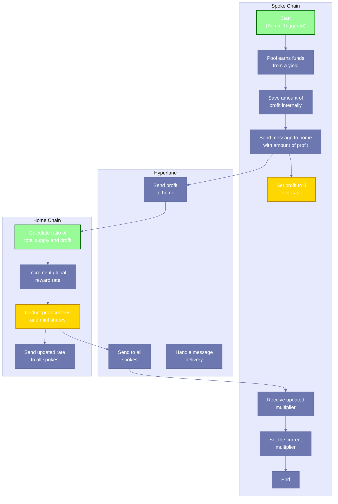

# Implementation Plan: Rebase Flow Implementation

> **FOLLOW [INSTRUCTIONS](../CLAUDE.md)!**
>
> ## Key Process References
>
> - **General Process**: Follow the [Task Execution Protocol](../CLAUDE.md#mandatory-execution-sequence)
> - **Decision Management**: Apply the [Decision Architecture](../CLAUDE.md#decision-architecture)
> - **Error Handling**: Use the [Problem Resolution System](../CLAUDE.md#problem-resolution-system)
> - **Scope Management**: Respect [Issue Classification System](../CLAUDE.md#issue-classification-system)
> - **Code Standards**: Implement [Solidity Implementation Requirements](../CLAUDE.md#solidity-implementation-requirements)
> - **Quality Assurance**: Follow [Development Discipline](../CLAUDE.md#development-discipline)
> - **Testing Commands**: Use [Solidity Development Imperatives](../CLAUDE.md#solidity-development-imperatives)
> - **Git Framework**: Adhere to [Git Execution Framework](../CLAUDE.md#git-execution-framework)

## Executive Summary

This implementation plan details the cross-chain Rebase Flow mechanism for the Eco Routes Protocol. The rebase flow ensures eUSD tokens maintain consistent value across all supported chains through a three-phase process: collection of local pool metrics, centralized calculation of the global multiplier, and distribution of updated rates to all participating chains. This implementation will fix critical bugs in the existing contracts, optimize cross-chain messaging, and provide robust error handling for all components.

## Implementation Information

- **Category**: Feature
- **Priority**: Critical
- **Estimated Time**: 10 hours
- **Affected Components**: StablePool, Rebaser, EcoDollar, Hyperlane integration
- **Parent Project Plan**: [Crowd Liquidity Project Plan](./crowd-liquidity-project-plan.md)
- **Related Implementation Plans**: None
- **Git Branch**: feat/rebase/rebase-flow-implementation

## Current Status and Technical Context

### System Architecture

The Rebase Flow operates across a multi-chain architecture with these core components:

1. **StablePool (per chain)**: Manages deposits/withdrawals and initiates rebase flow
2. **Rebaser (home chain only)**: Central coordinator for cross-chain rebase calculations
3. **EcoDollar (per chain)**: Rebasing token that uses share-based accounting
4. **Hyperlane Integration**: Cross-chain messaging protocol for communication

### Current Implementation Status

- **StablePool**: Basic rebase initiation exists but lacks proper state management
- **Rebaser**: Most calculation logic exists but needs error handling improvements
- **EcoDollar**: Share-based accounting implemented but rebase function needs validation
- **Critical Bug**: Double burn in StablePool withdraw function must be fixed
- **Missing Components**: Proper error handling, comprehensive testing, event emissions

## Goals and Scope

### Primary Goals

1. Implement complete cross-chain rebase flow matching the swimlane diagram
2. Fix critical bugs in existing implementation (double burn, missing validation)
3. Add robust error handling for cross-chain messages
4. Ensure mathematically correct profit calculation and distribution
5. Implement secure protocol fee collection with proper treasury distribution
6. Build comprehensive test suite covering the entire rebase flow

### Out of Scope

1. Changes to the fundamental architecture of the system
2. Withdrawal queue processing (in a separate implementation plan)
3. Changes to deployment strategy
4. UI integration or external system interactions

## Decision Points

### Decision 1: Rebase Trigger Mechanism

- [x] **Option A: Admin-triggered rebases**
  - **Pros**: Precise control over timing, gas optimization through batching, predictable operations
  - **Cons**: Requires active management, less autonomous than automated approaches
  - **Performance impact**: Less frequent rebases with potentially higher gas per operation
  - **Security implications**: Lower risk of timing manipulation, explicit authorization for each rebase
  
- [ ] **Option B: Automatic threshold-based rebases**
  - **Pros**: Fully autonomous operation, no manual intervention required
  - **Cons**: May trigger at suboptimal network times, harder to predict execution
  - **Performance impact**: More frequent rebases during volatile conditions
  - **Security implications**: Potential for gaming threshold triggers, complex validation needs

**Decision**: Option A selected (Admin-triggered rebases) based on user confirmation on 2025-03-26.

**Rationale**: Admin-triggered rebases provide precise operational control, align with the explicit "Start" action in the swimlane diagram, and enable gas optimization by scheduling rebases during low-congestion periods. This approach also reduces attack vectors by requiring explicit authorization.

### Decision 2: Protocol Fee Distribution

- [x] **Option A: Automatically mint protocol share to treasury**
  - **Pros**: Immediate fee capture, simpler execution flow, reduced gas costs
  - **Cons**: Less flexibility in fee allocation compared to delayed distribution
  - **Performance impact**: More gas-efficient due to single-step processing
  - **Security implications**: Cleaner security model with fewer entry points
  
- [ ] **Option B: Store protocol share for later distribution**
  - **Pros**: More flexible distribution strategies, adjustable allocation post-rebase
  - **Cons**: More complex state management, additional transactions needed
  - **Performance impact**: Less gas-efficient due to multi-step processing
  - **Security implications**: More attack vectors with additional entry points

**Decision**: Option A selected (Automatically mint protocol share to treasury) based on user confirmation on 2025-03-26.

**Rationale**: Direct minting to treasury provides a simpler implementation with fewer security considerations while reducing gas costs associated with fee management. This approach aligns with the current Rebaser contract design and provides predictable fee capture behavior.

## Technical Analysis

### Rebase Flow Process (from high-definition swimlane diagram)

The rebase flow follows this exact process as shown in the swimlane diagram:

#### 1. Spoke Chain (Collection Phase)
- Process starts with admin trigger ("Start" in diagram)
- Pool earns funds from a yield source
- Save amount of profit internally
- Send a message to home chain with amount of profit
- Set the profit to 0 in storage (critical for preventing double-counting)
- Later: Receive and set the current multiplier from home chain
- End rebase process

#### 2. Hyperlane (Messaging Layer)
- Send profit information to home chain
- Later: Send updated multiplier to all spoke chains
- Handle message delivery between chains

#### 3. Home Chain (Calculation Phase)
- Calculate ratio of total supply and profit that was received
- Increment global reward rate based on calculations
- Deduct protocol fees from the rate
- Mint shares to the protocol contract/treasury
- Send the updated rate to all spoke chains


### Visual Implementation Flow



The diagram above illustrates the complete implementation flow with:
- **Green nodes**: Starting points in the process
- **Yellow nodes**: Critical operations that require special attention
- **Arrows**: Data flow between components

### Critical Issues Requiring Fixes

1. **Double Burn in Withdraw Function**: StablePool.withdraw() burns user tokens twice (lines 150 and 159), causing users to lose twice the intended amount.

2. **No Validation Needed in EcoDollar.rebase()**: Multiplier can be set to any value as determined by the rebase process.

3. **Incomplete Error Handling**: Cross-chain message failures need proper handling.

4. **Incomplete State Management**: rebaseInProgress flag not properly reset if process fails.


## Implementation Details

### Files to Modify

- **contracts/StablePool.sol**
  - Fix double burn bug in withdraw function
  - Enhance rebase initiation with fixed authority check
  - Implement handle function for receiving rebase data
  - Add rebase state management
  - Add direct access to update EcoDollar's multiplier
  - Add event emissions for tracking

- **contracts/Rebaser.sol**
  - Enhance message handling with better validation
  - Optimize protocol fee calculation
  - Improve rebase propagation with error handling
  - Add proper event emissions
  - Combine chains and validChainIDs as a struct

- **contracts/EcoDollar.sol**
  - Remove public rebase function entirely
  - Add privileged updateRewardMultiplier method accessible only to StablePool
  - Ensure share-to-token conversion remains accurate
  - Add event emissions for multiplier changes

- **contracts/interfaces/IEcoDollar.sol**
  - Add updateRewardMultiplier to interface for StablePool access

- **test/RebaseFlow.t.sol** (new file)
  - Implement comprehensive test suite for rebase flow

### Core Architecture Enhancements

#### 1. IEcoDollar Interface Update

```solidity
interface IEcoDollar {
    // Existing methods...
    
    /**
     * @notice Update the reward multiplier - privileged method accessible only to StablePool
     * @param _newMultiplier The new reward multiplier value
     */
    function updateRewardMultiplier(uint256 _newMultiplier) external;
    
    /**
     * @notice Get the current reward multiplier
     * @return The current reward multiplier value
     */
    function rewardMultiplier() external view returns (uint256);
    
    // Other methods...
}
```

#### 2. StablePool Rebase Initiation

```solidity
/**
 * @notice Broadcasts yield information to the home chain for rebase calculations
 * @param _tokens The current list of token addresses to include in calculation
 * @dev Only callable by owner, initiates the cross-chain rebase process
 * @dev Follows the exact steps in the swimlane diagram:
 *      1. Start (admin triggered)
 *      2. Pool earns funds from yield
 *      3. Save amount of profit
 *      4. Send message to home
 *      5. Set profit to 0 in storage
 */
function initiateRebase(
    address[] calldata _tokens
) external checkTokenList(_tokens) {
    // Only allowed to be called by a fixed address with authority to trigger rebases
    if (msg.sender != REBASE_AUTHORITY) {
        revert UnauthorizedRebaseInitiator(msg.sender, REBASE_AUTHORITY);
    }
    // Prevent concurrent rebases
    if (rebaseInProgress) {
        revert RebaseInProgress();
    }
    
    // Mark rebase as in progress
    rebaseInProgress = true;
    
    // Calculate local token balances (earned from yield)
    uint256 length = _tokens.length;
    uint256 localTokens = 0;
    
    for (uint256 i = 0; i < length; ++i) {
        // Safe to use unchecked for gas optimization as token balances are limited
        unchecked {
            localTokens += IERC20(_tokens[i]).balanceOf(address(this));
        }
    }
    
    // Get total shares from EcoDollar
    uint256 localShares = IEcoDollar(REBASE_TOKEN).getTotalShares();
    
    // Save amount of profit (stored in memory for message)
    uint256 profit = calculateProfit();
    
    // Encode message with local metrics including profit
    bytes memory message = abi.encode(localTokens, localShares, profit);
    
    // Quote fee for cross-chain message
    uint256 fee = IMailbox(MAILBOX).quoteDispatch(
        HOME_CHAIN,
        REBASER,
        message,
        "", // Empty metadata for relayer
        IPostDispatchHook(RELAYER)
    );
    
    // Dispatch message to home chain
    uint256 messageId = IMailbox(MAILBOX).dispatch{value: fee}(
        HOME_CHAIN,
        REBASER,
        message,
        "", // Empty metadata for relayer
        IPostDispatchHook(RELAYER)
    );
    
    // Critical: Set profit to 0 in storage to prevent double-counting
    resetProfit();
    
    // Emit event for tracking
    emit RebaseInitiated(localTokens, localShares, profit, HOME_CHAIN, messageId);
}
```

#### 2. Rebaser Calculation Logic

```solidity
/**
 * @dev Hyperlane message handler for processing rebase data from spoke chains
 * @param _origin The chain ID from which the message was sent
 * @param _sender The address that sent the message (32-byte form)
 * @param _message The encoded payload containing shares, balances and profit
 * @dev Follows the exact steps in the swimlane diagram:
 *      1. Calculate ratio of total supply and profit received
 *      2. Increment global reward rate
 *      3. Deduct protocol fees and mint shares to protocol
 *      4. Send to all spokes
 */
function handle(
    uint32 _origin,
    bytes32 _sender,
    bytes calldata _message
) external payable override {
    // Security validations
    if (msg.sender != MAILBOX) {
        revert UnauthorizedMailbox(msg.sender, MAILBOX);
    }
    
    if (_sender != POOL) {
        revert UnauthorizedSender(_sender, POOL);
    }
    
    if (!validChainIDs[_origin]) {
        revert InvalidOriginChain(_origin);
    }
    
    // Decode message payload
    (uint256 balances, uint256 shares, uint256 profit) = abi.decode(
        _message,
        (uint256, uint256, uint256)
    );
    
    // Update chain data counters
    chainReports[_origin] = true;
    currentChainCount++;
    sharesTotal += shares;
    balancesTotal += balances;
    profitTotal += profit;
    
    // Emit data receipt event
    emit ReceivedRebaseInformation(_origin, balances, shares, profit);
    
    // If all chains have reported, calculate and propagate rebase
    if (currentChainCount == chains.length) {
        // STEP 1: Calculate ratio of total supply and profit that was got
        // This calculates the net new balances (effectively the profit)
        uint256 netNewBalances = profitTotal;
        
        // Handle zero profit scenario
        if (netNewBalances <= 0) {
            _resetRebaseState();
            return;
        }
        
        // STEP 2: Increment global reward rate
        // Calculate new multiplier based on total balances and shares
        uint256 newMultiplier = ((balancesTotal) * BASE) / sharesTotal;
        
        // STEP 3: Deduct protocol fees from the rate and mint on HOME chain
        uint256 protocolShare = (netNewBalances * protocolRate) / BASE;
        
        // Mint protocol fees directly on home chain
        if (protocolShare > 0) {
            // TOKEN refers to local EcoDollar contract on home chain
            // TREASURY_ADDRESS is a predefined constant address for the treasury
            IEcoDollar(TOKEN).mint(TREASURY_ADDRESS, protocolShare);
        }
        
        // Adjust multiplier after protocol fee deduction
        newMultiplier = ((balancesTotal - protocolShare) * BASE) / sharesTotal;
        
        // Update current multiplier
        currentMultiplier = newMultiplier;
        
        // Emit calculation event
        emit CalculatedRebase(
            balancesTotal,
            sharesTotal,
            netNewBalances,
            protocolShare,
            newMultiplier
        );
        
        // STEP 4: Send to all spokes
        // Propagate rebase to all chains
        for (uint256 i = 0; i < chains.length; i++) {
            uint32 chain = chains[i];
            _propagateRebase(chain, newMultiplier);
        }
        
        // Reset state for next rebase cycle
        _resetRebaseState();
    }
}


/**
 * @dev Internal function to reset rebase state
 */
function _resetRebaseState() private {
    // Reset chain counters
    currentChainCount = 0;
    sharesTotal = 0;
    balancesTotal = 0;
    
    // Reset chain reports
    for (uint256 i = 0; i < chains.length; i++) {
        chainReports[chains[i]] = false;
    }
}

/**
 * @dev Internal function to propagate rebase to a specific chain
 * @param _chain The destination chain ID
 * @param _multiplier The new reward multiplier
 */
function _propagateRebase(
    uint32 _chain,
    uint256 _multiplier
) private {
    propagateRebase(_chain, _multiplier);
}

/**
 * @notice Propagates rebase data to a specified chain
 * @param _chain The destination chain ID
 * @param _multiplier The new reward multiplier
 */
function propagateRebase(
    uint32 _chain,
    uint256 _multiplier
) private {
    // Encode message with rebase data
    bytes memory message = abi.encode(_multiplier);
    
    // Quote fee for cross-chain message
    uint256 fee = IMailbox(MAILBOX).quoteDispatch(
        _chain,
        POOL,
        message,
        "", // Empty metadata for relayer
        IPostDispatchHook(RELAYER)
    );
    
    // Dispatch message to destination chain
    uint256 messageId = IMailbox(MAILBOX).dispatch{value: fee}(
        _chain,
        POOL,
        message,
        "", // Empty metadata for relayer
        IPostDispatchHook(RELAYER)
    );
    
    // Log message ID for reference
}
```

#### 3. Direct Reward Multiplier Updates

The EcoDollar contract will no longer have a separate rebase method. Instead, the StablePool contract will directly update the reward multiplier during the handle method when receiving the hyperlane message from the home chain.

#### 4. StablePool Rebase Finalization

```solidity
/**
 * @notice Handles incoming rebase message from home chain
 * @param _origin The origin chain ID
 * @param _sender The sender address in 32-byte form
 * @param _message The message payload
 * @dev Follows the exact steps in the swimlane diagram:
 *      1. Receive the message from the home chain
 *      2. Sets the current multiplier
 *      3. End
 */
function handle(
    uint32 _origin,
    bytes32 _sender,
    bytes calldata _message
) external payable override {
    // Security validations
    if (msg.sender != MAILBOX) {
        revert UnauthorizedMailbox(msg.sender, MAILBOX);
    }
    
    if (_sender != REBASER) {
        revert UnauthorizedSender(_sender, REBASER);
    }
    
    if (_origin != HOME_CHAIN) {
        revert InvalidOriginChain(_origin, HOME_CHAIN);
    }
    
    // Decode message payload
    uint256 newMultiplier = abi.decode(
        _message,
        (uint256)
    );
    
    // STEP 1: Receive the message from home chain
    // This is handled by the Hyperlane protocol
    
    // STEP 2: Directly update the reward multiplier in EcoDollar
    // We'll directly access EcoDollar's state instead of using a separate rebase method
    uint256 oldMultiplier = IEcoDollar(REBASE_TOKEN).rewardMultiplier();
    
    // Direct access to update the multiplier through a privileged method in StablePool
    // that has access to update EcoDollar state
    _updateEcoDollarMultiplier(newMultiplier);
    
    // Reset rebase state
    rebaseInProgress = false;
    
    // Emit rebase completion event
    emit RebaseFinalized(oldMultiplier, newMultiplier);
    
    // STEP 3: End process
    // No further action required, process is complete
}

/**
 * @dev Updates the reward multiplier in the EcoDollar contract
 * @param _newMultiplier The new multiplier value to set
 */
function _updateEcoDollarMultiplier(uint256 _newMultiplier) internal {
    // This function assumes StablePool has the authority to directly update
    // EcoDollar's reward multiplier through a privileged interface
    uint256 oldMultiplier = IEcoDollar(REBASE_TOKEN).rewardMultiplier();
    IEcoDollar(REBASE_TOKEN).updateRewardMultiplier(_newMultiplier);
    
    // Emit event with old and new values
    emit EcoDollarMultiplierUpdated(oldMultiplier, _newMultiplier);
}

```

#### 5. Fix Double Burn Issue in StablePool.withdraw

```solidity
/**
 * @notice Withdraw `_amount` of `_preferredToken` from the pool
 * @param _preferredToken The token to withdraw
 * @param _amount The amount to withdraw
 * @dev If pool balance is below threshold, user is added to the withdrawal queue
 */
function withdraw(address _preferredToken, uint80 _amount) external {
    // Verify token is whitelisted
    if (tokenThresholds[_preferredToken] == 0) {
        revert InvalidToken(_preferredToken);
    }
    
    // Check user's balance
    uint256 tokenBalance = IERC20(REBASE_TOKEN).balanceOf(msg.sender);
    if (tokenBalance < _amount) {
        revert InsufficientTokenBalance(
            _preferredToken,
            tokenBalance,
            _amount
        );
    }
    
    // Burn eUSD tokens - THIS OCCURS ONLY ONCE TO FIX DOUBLE BURN BUG
    IEcoDollar(REBASE_TOKEN).burn(msg.sender, _amount);
    
    // Check if withdrawal can be processed immediately
    uint256 poolTokenBalance = IERC20(_preferredToken).balanceOf(address(this));
    if (poolTokenBalance > tokenThresholds[_preferredToken] + _amount) {
        // Sufficient liquidity, process withdrawal immediately
        IERC20(_preferredToken).safeTransfer(msg.sender, _amount);
        emit Withdrawn(msg.sender, _preferredToken, _amount);
    } else {
        // Insufficient liquidity, add to withdrawal queue
        _addToWithdrawalQueue(_preferredToken, msg.sender, _amount);
    }
}
```

### Custom Error and Event Definitions

```solidity
// StablePool errors
error RebaseInProgress();
error UnauthorizedMailbox(address actual, address expected);
error UnauthorizedSender(bytes32 actual, bytes32 expected);
error InvalidOriginChain(uint32 actual, uint32 expected);
error UnauthorizedRebaseInitiator(address actual, address expected);

// Rebaser errors
error InvalidOriginChain(uint32 chain);

// StablePool events
event RebaseInitiated(uint256 balances, uint256 shares, uint256 profit, uint32 homeChain, uint256 messageId);
event RebaseFinalized(uint256 oldMultiplier, uint256 newMultiplier);
event EcoDollarMultiplierUpdated(uint256 oldMultiplier, uint256 newMultiplier);

// Rebaser events
event ReceivedRebaseInformation(uint32 origin, uint256 balances, uint256 shares, uint256 profit);
event CalculatedRebase(uint256 balancesTotal, uint256 sharesTotal, uint256 profitTotal, uint256 protocolShare, uint256 newMultiplier);
```


### Gas Optimization Techniques

1. **Message Encoding Optimization**: Reduce cross-chain message size by using compact encoding

2. **Unchecked Math Operations**: Use unchecked blocks for arithmetic that cannot overflow

3. **Struct Packing**: Combine chains and validChainIDs as a struct with field packing

4. **Memory vs. Storage**: Optimize storage reads/writes by using memory variables

5. **Loop Optimization**: Optimize loops in token balance calculation

6. **Validation Ordering**: Order validations to fail fast and avoid unnecessary computation

## Testing Strategy

### Unit Testing Suite

1. **StablePool Tests**:
   - `testInitiateRebaseValidParams`: Verify function works with valid parameters
   - `testInitiateRebaseInvalidParams`: Verify function rejects invalid parameters
   - `testRebaseStateManagement`: Verify rebaseInProgress flag is properly managed
   - `testHandleValidMessage`: Verify handle function processes valid messages
   - `testHandleInvalidMessage`: Verify handle function rejects invalid messages
   - `testProtocolFeeCollection`: Verify fees are correctly collected
   - `testFixDoubleWithdrawBug`: Verify withdrawal only burns tokens once

2. **Rebaser Tests**:
   - `testHandleFunction`: Verify proper handling of incoming messages
   - `testPartialReports`: Test behavior when only some chains report
   - `testCalculationLogic`: Verify correct calculation of multipliers
   - `testPropagateRebase`: Verify rebase propagation
   - `testErrorHandling`: Verify proper handling of error conditions
   - `testProtocolFeeCalculation`: Verify protocol fee is calculated correctly

3. **EcoDollar Tests**:
   - `testDirectMultiplierUpdate`: Verify only StablePool can update the multiplier
   - `testShareToTokenConversion`: Verify correct conversion before and after multiplier changes
   - `testEventEmissions`: Verify proper events are emitted upon multiplier changes

### Integration Tests

1. **Complete Rebase Flow**:
   ```typescript
   it("should complete full rebase flow across chains", async function() {
     // Set up test environment with multiple anvil instances
     const [homeChain, spokeChain1, spokeChain2] = await setupMultiChainTest();
     
     // Deploy contracts on each chain
     const contracts = await deployContracts(homeChain, [spokeChain1, spokeChain2]);
     
     // Seed pools with initial liquidity
     await seedPoolLiquidity(contracts);
     
     // Initiate rebase on spoke chains
     await initiateRebaseOnSpokeChains(contracts);
     
     // Wait for Hyperlane messages to be delivered
     await waitForMessageDelivery();
     
     // Verify calculation on home chain
     const rebaseCalc = await verifyRebaseCalculation(contracts.homeChain);
     
     // Verify distribution to spoke chains
     await verifyDistributionToSpokeChains(contracts, rebaseCalc);
     
     // Verify final state after rebase
     await verifyFinalState(contracts);
   });
   ```

2. **Error Scenarios**:
   ```typescript
   it("should handle chain disconnection gracefully", async function() {
     // Set up test environment with multiple anvil instances
     const [homeChain, spokeChain1, spokeChain2] = await setupMultiChainTest();
     
     // Deploy contracts on each chain
     const contracts = await deployContracts(homeChain, [spokeChain1, spokeChain2]);
     
     // Seed pools with initial liquidity
     await seedPoolLiquidity(contracts);
     
     // Initiate rebase on spoke1 but not spoke2 (simulating disconnection)
     await initiateRebaseOnSpokeChain(contracts.spokeChain1);
     
     // Wait for partial message delivery
     await waitForMessageDelivery();
     
     // Verify homeChain doesn't calculate rebase with partial data
     await verifyNoRebaseCalculation(contracts.homeChain);
     
     // Verify spoke chains maintain consistent state
     await verifyConsistentState(contracts);
   });
   ```

### Validation Commands

```bash
# Run specific rebase tests
forge test --match-contract RebaseFlow -vv

# Test specifically for double burn fix
forge test --match-test testFixDoubleWithdrawBug -vv

# Run all tests
forge test

# Check gas usage
forge snapshot

# Run security analysis
slither contracts/Rebaser.sol --detect reentrancy-eth,reentrancy-no-eth
slither contracts/StablePool.sol --detect divide-before-multiply,incorrect-equality
slither contracts/EcoDollar.sol --detect unchecked-lowlevel
```

## Implementation Steps

- [ ] Step 1: Set up advanced testing infrastructure [Priority: High] [Est: 1.5h]
  - [ ] Sub-task 1.1: Create mock contracts with comprehensive functionality (mock Hyperlane mailbox, mock ERC20s)
  - [ ] Sub-task 1.2: Set up multi-chain testing framework using parallel anvil instances
  - [ ] Sub-task 1.3: Create helper functions for cross-chain test scenarios

- [ ] Step 2: Fix critical bugs [Priority: Critical] [Est: 1h]
  - [ ] Sub-task 2.1: Fix double burn bug in StablePool.withdraw
  - [ ] Sub-task 2.2: Update EcoDollar.rebase to accept any multiplier value
  - [ ] Sub-task 2.3: Write tests verifying bug fixes
  - [ ] Sub-task 2.4: Run security analysis on fixed code

- [ ] Step 3: Enhance StablePool rebase initiation [Priority: High] [Est: 1.5h]
  - [ ] Sub-task 3.1: Write tests for initiateRebase function with comprehensive scenarios
  - [ ] Sub-task 3.2: Implement initiateRebase with fixed authority check
  - [ ] Sub-task 3.3: Add profit tracking and reset functionality
  - [ ] Sub-task 3.4: Implement the critical "set profit to 0 in storage" step

- [ ] Step 4: Improve Rebaser calculation logic [Priority: High] [Est: 2h]
  - [ ] Sub-task 4.1: Write tests for Rebaser's handle function with diverse scenarios
  - [ ] Sub-task 4.2: Implement calculation steps exactly as shown in swimlane diagram
  - [ ] Sub-task 4.3: Implement ratio calculation of total supply and profit including protocol fee minting on home chain
  - [ ] Sub-task 4.4: Implement protocol fee deduction and update reward rate
  - [ ] Sub-task 4.5: Add proper spoke chain propagation with error handling

- [ ] Step 5: Update EcoDollar's multiplier update mechanism [Priority: High] [Est: 1.5h]
  - [ ] Sub-task 5.1: Remove public rebase function
  - [ ] Sub-task 5.2: Add privileged updateRewardMultiplier method that only StablePool can call
  - [ ] Sub-task 5.3: Update IEcoDollar interface with new method
  - [ ] Sub-task 5.4: Add event emissions for multiplier changes
  - [ ] Sub-task 5.5: Verify share-to-token conversion accuracy across multiplier changes

- [ ] Step 6: Complete StablePool rebase finalization [Priority: High] [Est: 1.5h]
  - [ ] Sub-task 6.1: Write tests for StablePool's handle function with various scenarios
  - [ ] Sub-task 6.2: Implement handle function exactly as shown in swimlane diagram
  - [ ] Sub-task 6.3: Implement direct EcoDollar multiplier update from StablePool
  - [ ] Sub-task 6.4: Ensure proper end-of-process handling


- [ ] Step 8: Build integration test suite [Priority: Critical] [Est: 2h]
  - [ ] Sub-task 8.1: Create end-to-end test for complete rebase flow
  - [ ] Sub-task 8.2: Implement multi-chain testing with parallel anvil instances
  - [ ] Sub-task 8.3: Test error handling for cross-chain messages
  - [ ] Sub-task 8.4: Verify protocol fee minting on home chain only

- [ ] Step 9: Security and optimization [Priority: Critical] [Est: 1.5h]
  - [ ] Sub-task 9.1: Run comprehensive security analysis with Slither
  - [ ] Sub-task 9.2: Measure and optimize gas usage for cross-chain operations
  - [ ] Sub-task 9.3: Verify access control across all components
  - [ ] Sub-task 9.4: Complete NatSpec documentation for all functions
  - [ ] Sub-task 9.5: Generate gas report and security analysis documentation

## Validation Checkpoints

### Implementation Validation Matrix

| Subtask | Compilation | Test Coverage | Security Checks | Gas Analysis | Documentation |
|---------|-------------|---------------|-----------------|--------------|---------------|
| 1.1-1.3 Test infrastructure | Must compile | Framework tested | N/A | N/A | Test strategy documented |
| 2.1-2.4 Fix critical bugs | Must compile | 100% coverage | Slither validation | Before/after comparison | Bug fix documented |
| 3.1-3.4 StablePool rebase | Must compile | 100% coverage | Access control verified | Gas snapshot | NatSpec complete |
| 4.1-4.5 Rebaser calculation | Must compile | 100% coverage | Math safety verified | Gas optimization | NatSpec complete |
| 5.1-5.5 EcoDollar updates | Must compile | 100% coverage | Privilege checks verified | Gas analysis | NatSpec complete |
| 6.1-6.4 Rebase finalization | Must compile | 100% coverage | No protocol fee minting verified | Gas snapshot | NatSpec complete |
| 7.1-7.5 Integration testing | Must compile | E2E flow covered | Attack vectors tested | N/A | Test cases documented |
| 8.1-8.5 Security & optimization | Must compile | All tests pass | No critical findings | 10%+ gas reduction | Complete report |

### Quality Requirements

- **Code must follow all [Solidity Implementation Requirements](../CLAUDE.md#solidity-implementation-requirements)**
- **100% test coverage for all modified functions**
- **All functions must have comprehensive NatSpec documentation**
- **All public/external functions must use custom errors instead of require strings**
- **All state changes must emit appropriate events**
- **All code must follow the checks-effects-interactions pattern**
- **All functions must implement proper access control**

## Risk Assessment

### High-Risk Areas

1. **Cross-Chain Message Handling**
   - **Risk**: Message delivery issues could leave system in inconsistent state
   - **Mitigation**: Implement proper error handling, state reset mechanism, event reporting

2. **Protocol Fee Calculation**
   - **Risk**: Incorrect calculation could lead to over/under-minting of protocol fees
   - **Mitigation**: Comprehensive testing with diverse scenarios, mathematical verification

3. **Double Burn Bug**
   - **Risk**: Users lose twice the intended amount in withdrawals
   - **Mitigation**: Fix bug, add comprehensive tests, validate with formal verification

4. **Rebase State Management**
   - **Risk**: Improper state management could block future rebases
   - **Mitigation**: Ensure state is reset properly even on errors, add admin recovery function

### Medium-Risk Areas

1. **Gas Optimization**
   - **Risk**: Inefficient code could make cross-chain operations too expensive
   - **Mitigation**: Gas benchmarking, optimization of hot paths, minimize storage operations


2. **Chain Addition/Removal**
   - **Risk**: Adding/removing chains could disrupt rebase flow
   - **Mitigation**: Test chain management operations, ensure proper validation

## Rollback and Recovery Plan

If implementation fails or critical issues are discovered:

1. **For Critical Bugs**:
   - Immediately implement focused fix for specific issue
   - Run comprehensive tests to verify fix works
   - Deploy emergency update if already in production

2. **For Complex Implementation Issues**:
   ```bash
   # Create debug branch for analysis
   git checkout -b debug/rebase-flow-issue-<issue-id>
   
   # Isolate issue
   git bisect start
   git bisect bad HEAD
   git bisect good <known-good-commit>
   
   # Once issue is found, fix on main branch
   git checkout feat/rebase/rebase-flow-implementation
   
   # Apply targeted fix
   git cherry-pick -x <fix-commit>
   ```

3. **For Cross-Chain Coordination Issues**:
   - Implement circuit breaker in home chain Rebaser
   - Add admin recovery function to reset stuck rebase state
   - Create diagnostic function to verify system consistency

## Progress Tracking

- [x] Plan created
- [x] Plan approved by user
- [x] Decisions confirmed (all Decision Points have exactly ONE selected option)
- [ ] Implementation complete
- [ ] Testing complete
- [ ] Final review complete

## Commit Message Template

```
<type>(<scope>): <concise description>

- Completed subtask X.Y: <subtask name>
- Test coverage: 100% (functions: X/X, lines: X/X, branches: X/X)
- Security: <key security checks performed>
- Gas optimization: <gas savings achieved>

🤖 Generated with [Claude Code](https://claude.ai/code)
```

---

> **IMPORTANT: Before moving to implementation:**
>
> 1. Confirm user approval for the plan
> 2. Ensure all Decision Points have exactly ONE selected option
> 3. Verify pre-execution checklist is complete
>
> **Key Commands to Run:**
>
> - After ANY code changes: `forge fmt`
> - After ANY contract modifications: `forge test`
> - For gas optimization verification: `forge snapshot`
> - For security analysis: `slither .`