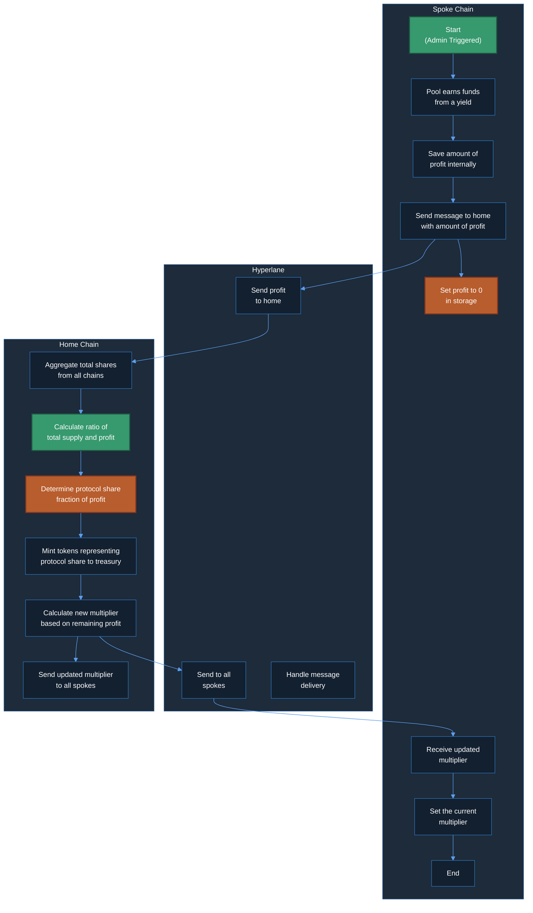
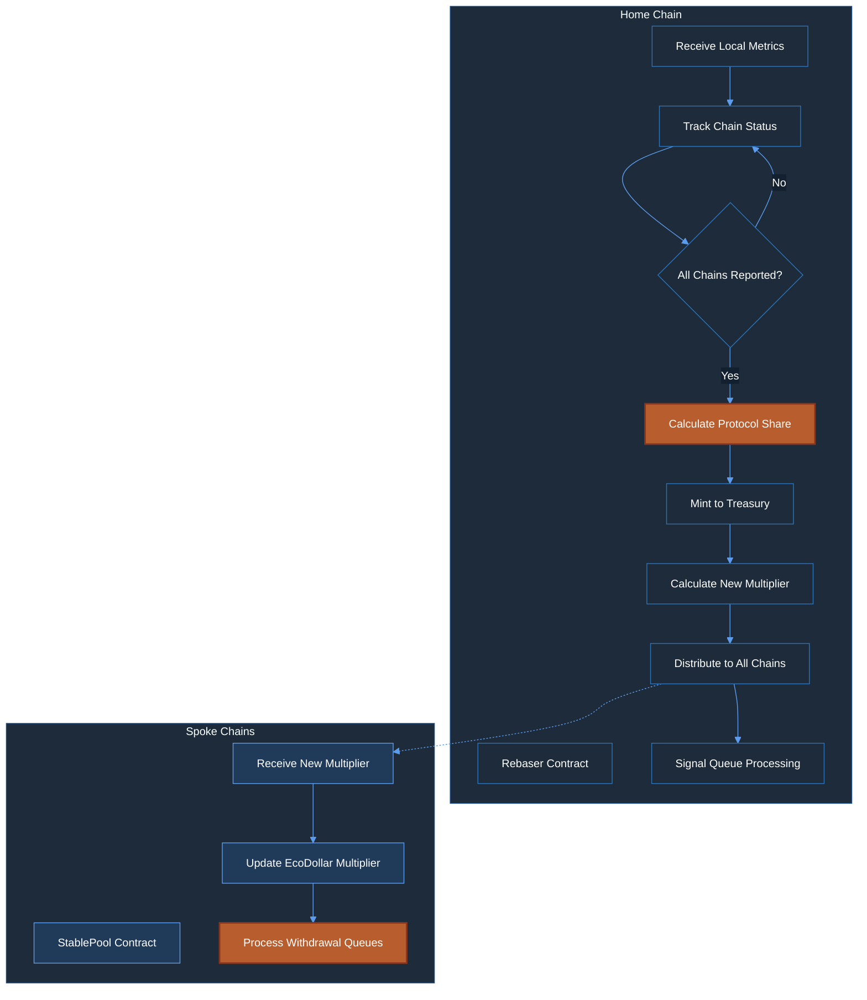

# Implementation Plan: Rebase Flow Implementation

> **FOLLOW [INSTRUCTIONS](../CLAUDE.md)!**
>
> ## Key Process References
>
> - **General Process**: Follow the [Task Execution Protocol](../CLAUDE.md#mandatory-execution-sequence)
> - **Decision Management**: Apply the [Decision Architecture](../CLAUDE.md#decision-architecture)
> - **Error Handling**: Use the [Problem Resolution System](../CLAUDE.md#problem-resolution-system)
> - **Scope Management**: Respect [Issue Classification System](../CLAUDE.md#issue-classification-system)
> - **Code Standards**: Implement [Solidity Implementation Requirements](../CLAUDE.md#solidity-implementation-requirements)
> - **Quality Assurance**: Follow [Development Discipline](../CLAUDE.md#development-discipline)
> - **Testing Commands**: Use [Solidity Development Imperatives](../CLAUDE.md#solidity-development-imperatives)
> - **Git Framework**: Adhere to [Git Execution Framework](../CLAUDE.md#git-execution-framework)

## Executive Summary

This implementation plan details the cross-chain Rebase Flow mechanism for the Eco Routes Protocol utilizing a rebase-synchronized withdrawal queue model. The rebase flow ensures eUSD tokens maintain consistent value and fair profit distribution across all supported chains through a synchronized process: withdrawals are queued with tokens locked but not burned, a rebase process collects metrics from all chains, calculates a new multiplier centrally, propagates the updated multiplier to all chains, and finally processes all withdrawal queues using the new multiplier. This approach ensures perfect fairness in profit distribution, minimizes cross-chain message overhead, and eliminates cross-chain consistency challenges while maintaining protocol economic integrity.

## Implementation Information

- **Category**: Feature
- **Priority**: Critical
- **Estimated Time**: 10 hours
- **Affected Components**: StablePool, Rebaser, EcoDollar, Hyperlane integration
- **Parent Project Plan**: [Crowd Liquidity Project Plan](./crowd-liquidity-project-plan.md)
- **Related Implementation Plans**: None
- **Git Branch**: feat/rebase/rebase-flow-implementation

## Current Status and Technical Context

### System Architecture

The Rebase Flow operates across a multi-chain architecture with these core components:

1. **StablePool (per chain)**: Manages deposits, withdrawal queues, and participates in rebase flow
2. **Rebaser (home chain only)**: Central coordinator for cross-chain rebase calculations
3. **EcoDollar (per chain)**: Rebasing token that uses share-based accounting
4. **Hyperlane Integration**: Cross-chain messaging protocol for communication

### Current Implementation Status

- **StablePool**: Basic rebase handling exists but lacks withdrawal queue functionality
- **Rebaser**: Most calculation logic exists but needs synchronization improvements
- **EcoDollar**: Share-based accounting implemented but rebase function needs validation
- **Critical Bug**: Double burn in StablePool withdraw function must be fixed
- **Missing Components**: Withdrawal queue system, rebase synchronization, proper error handling, comprehensive testing, event emissions

## Goals and Scope

### Primary Goals

1. Implement rebase-synchronized withdrawal queue system across all chains
2. Implement complete cross-chain rebase flow with synchronized processing
3. Fix critical issues in existing implementation (update reward multiplier, remove rebaseInProgress flag)
4. Ensure mathematically correct profit calculation and distribution
5. Implement secure protocol share allocation and treasury distribution
6. Ensure fair profit distribution to all users regardless of withdrawal timing
7. Build comprehensive test suite covering the entire rebase flow

### Out of Scope

1. Changes to the fundamental architecture of the system beyond withdrawal queue implementation
2. Cross-chain message handling (will be handled by a service)
3. Testing integration with external messaging service
4. Changes to deployment strategy
5. UI integration or external system interactions
6. Secondary markets for withdrawal queue positions
7. Advanced queue optimization strategies

## Decision Points

### Decision 1: Rebase Trigger Mechanism

- [x] **Option A: Admin-triggered rebases**
  - **Pros**: Precise control over timing, gas optimization through batching, predictable operations
  - **Cons**: Requires active management, less autonomous than automated approaches
  - **Performance impact**: Less frequent rebases with potentially higher gas per operation
  - **Security implications**: Lower risk of timing manipulation, explicit authorization for each rebase
  
- [ ] **Option B: Automatic threshold-based rebases**
  - **Pros**: Fully autonomous operation, no manual intervention required
  - **Cons**: May trigger at suboptimal network times, harder to predict execution
  - **Performance impact**: More frequent rebases during volatile conditions
  - **Security implications**: Potential for gaming threshold triggers, complex validation needs

**Decision**: Option A selected (Admin-triggered rebases) based on user confirmation on 2025-03-26.

**Rationale**: Admin-triggered rebases provide precise operational control, align with the explicit "Start" action in the swimlane diagram, and enable gas optimization by scheduling rebases during low-congestion periods. This approach also reduces attack vectors by requiring explicit authorization.

### Decision 2: Protocol Fee Distribution

- [x] **Option A: Automatically mint protocol share to treasury**
  - **Pros**: Immediate fee capture, simpler execution flow, reduced gas costs
  - **Cons**: Less flexibility in fee allocation compared to delayed distribution
  - **Performance impact**: More gas-efficient due to single-step processing
  - **Security implications**: Cleaner security model with fewer entry points
  
- [ ] **Option B: Store protocol share for later distribution**
  - **Pros**: More flexible distribution strategies, adjustable allocation post-rebase
  - **Cons**: More complex state management, additional transactions needed
  - **Performance impact**: Less gas-efficient due to multi-step processing
  - **Security implications**: More attack vectors with additional entry points

**Decision**: Option A selected (Automatically mint protocol share to treasury) based on user confirmation on 2025-03-26.

**Rationale**: Direct minting to treasury provides a simpler implementation with fewer security considerations while reducing gas costs associated with fee management. This approach aligns with the current Rebaser contract design and provides predictable fee capture behavior.

## Technical Analysis

### Rebase Flow Process (from high-definition swimlane diagram)

The rebase flow follows this exact process as shown in the swimlane diagram:

#### 1. Spoke Chain (Collection Phase)
- Process starts with admin trigger ("Start" in diagram)
- Pool earns funds from a yield source
- Profit is tracked as a variable in the StablePool contract
- Total EcoDollar shares are tracked and updated on deposits/withdrawals
- Send a message to home chain with amount of profit and current total shares
- Set the profit to 0 in storage (critical for preventing double-counting)
- Later: Receive and set the current multiplier from home chain
- End rebase process

#### 2. Hyperlane (Messaging Layer)
- Send profit information to home chain
- Later: Send updated multiplier to all spoke chains
- Handle message delivery between chains

#### 3. Home Chain (Calculation Phase)
- Aggregate total shares reported from all chains
- Track total supply across the entire protocol
- Calculate ratio of total supply and profit that was received
- Determine protocol share (fraction of profit allocated to protocol)
- Mint tokens representing protocol share to the treasury
- Calculate new multiplier based on remaining profit and total shares
- Send the updated multiplier to all spoke chains


### Visual Implementation Flow



The diagram above illustrates the complete implementation flow with:
- **Green nodes**: Starting points in the process
- **Yellow nodes**: Critical operations that require special attention
- **Arrows**: Data flow between components

### Critical Issues Requiring Fixes

1. **No Validation Needed in EcoDollar.updateRewardMultiplier()**: Multiplier can be set to any value as determined by the rebase process.


## Implementation Details

### Files to Modify

- **contracts/StablePool.sol**
  - Implement withdrawal queue system with queue management functions
  - Modify withdraw function to queue withdrawals instead of processing immediately
  - Add queue processing function to execute after rebase
  - Add profit tracking variable to store accumulated profit
  - Update deposit function to maintain protocol accounting
  - Enhance rebase initiation with fixed authority check
  - Implement handle function for receiving rebase data
  - Add direct access to update EcoDollar's multiplier
  - Add event emissions for queue operations and rebase events

- **contracts/Rebaser.sol**
  - Implement tracking of total EcoDollar shares across all chains
  - Enhance protocol share calculation using protocolShareRate
  - Add synchronization for withdrawal queue processing
  - Add owner-controlled function to update protocolShareRate
  - Add proper event emissions for share tracking and protocol share allocation
  - Combine chains and validChainIDs as a struct
  - Maintain proper protocol state for external message handling service

- **contracts/EcoDollar.sol**
  - Remove public rebase function entirely
  - Add privileged updateRewardMultiplier method accessible only to StablePool
  - Ensure share-to-token conversion remains accurate
  - Add event emissions for multiplier changes

- **contracts/interfaces/IEcoDollar.sol**
  - Add updateRewardMultiplier to interface for StablePool access

- **test/RebaseFlow.t.sol** (new file)
  - Implement comprehensive test suite for rebase flow and withdrawal queue

### Core Architecture Enhancements

#### 1. Rebase-Synchronized Withdrawal Queue System

The rebase-synchronized withdrawal queue approach fundamentally changes how withdrawals and rebases interact in the protocol:

```mermaid
%%{init: {'theme': 'dark', 'themeVariables': { 'primaryColor': '#2D74BA', 'primaryTextColor': '#FFFFFF', 'primaryBorderColor': '#1D4E89', 'lineColor': '#5D9CEC', 'secondaryColor': '#1D2B3A', 'tertiaryColor': '#132030', 'textColor': '#FFFFFF', 'fontSize': '14px', 'fontFamily': 'Arial', 'edgeLabelBackground': '#132030', 'mainBkg': '#132030', 'clusterBkg': '#1D2B3A', 'altBackground': '#132030', 'actorBkg': '#2D74BA', 'actorBorder': '#1D4E89', 'actorTextColor': '#FFFFFF', 'noteBkgColor': '#284665', 'noteBorderColor': '#2D74BA', 'noteTextColor': '#FFFFFF' }}}%%

sequenceDiagram
    participant Users
    participant StablePool
    participant EcoDollar
    participant Mailbox
    participant Rebaser
    
    rect rgb(24, 44, 67)
    Note over Users,StablePool: Normal Operation Period
    Users->>StablePool: Deposit funds
    StablePool->>EcoDollar: Mint tokens
    EcoDollar-->>EcoDollar: Update shares internally
    
    Users->>StablePool: Request withdrawal
    StablePool->>StablePool: Lock tokens in withdrawal queue
    StablePool-->>Users: Withdrawal queued confirmation
    end
    
    rect rgb(32, 59, 89)
    Note over StablePool,Rebaser: Rebase Initiation Phase
    StablePool->>EcoDollar: getTotalShares()
    EcoDollar-->>StablePool: Current total shares
    StablePool->>StablePool: Calculate local profit
    StablePool->>Mailbox: Send local metrics to home chain
    Mailbox-->>Rebaser: Deliver local metrics
    end
    
    rect rgb(49, 78, 112)
    Note over StablePool,Rebaser: Rebase Calculation Phase
    Rebaser->>Rebaser: Aggregate metrics from all chains
    Rebaser->>Rebaser: Calculate protocol share
    Rebaser->>Rebaser: Mint protocol share to treasury
    Rebaser->>Rebaser: Calculate new multiplier
    Rebaser->>Mailbox: Distribute new multiplier to all chains
    Mailbox-->>StablePool: Deliver new multiplier
    StablePool->>EcoDollar: updateRewardMultiplier()
    end
    
    rect rgb(59, 94, 135)
    Note over StablePool,Users: Withdrawal Processing Phase
    StablePool->>StablePool: Process withdrawal queue
    StablePool->>EcoDollar: Burn tokens for queued withdrawals
    StablePool->>Users: Transfer withdrawn assets
    StablePool-->>Users: Withdrawal complete confirmation
    end
```



This approach provides several key advantages:

1. **Fair Profit Distribution**: All users, whether staying or leaving, receive their fair share of profits through the rebase
2. **Cross-Chain Efficiency**: Eliminates the need for per-transaction cross-chain messaging
3. **Perfect Consistency**: No need for complex delta tracking or sequence verification
4. **Economic Integrity**: Prevents users from "escaping" before rebases apply profits across the system

#### 2. Withdrawal Queue Implementation Details

```solidity
/**
 * @notice Withdrawal queue entry structure
 */
struct WithdrawalRequest {
    address user;           // User requesting withdrawal
    uint256 shareAmount;    // Amount in shares (not tokens)
    address preferredToken; // Token to receive upon withdrawal
    uint256 requestTime;    // Timestamp of request
    bool processed;         // Whether this request has been processed
}

/**
 * @notice Withdrawal queue tracking
 */
mapping(uint256 => WithdrawalRequest) public withdrawalQueue;
uint256 public nextWithdrawalId;        // Next ID to assign
uint256 public firstPendingWithdrawal;  // First unprocessed withdrawal
bool public withdrawalProcessingActive; // Processing state flag

/**
 * @notice Standard deposit function
 * @param _token The token to deposit
 * @param _amount The amount to deposit
 */
function deposit(address _token, uint256 _amount) external {
    // Verify token is whitelisted
    if (tokenThresholds[_token] == 0) {
        revert InvalidToken(_token);
    }
    
    // Transfer token from user to pool
    IERC20(_token).safeTransferFrom(msg.sender, address(this), _amount);
    
    // Mint eUSD tokens to the user
    IEcoDollar(REBASE_TOKEN).mint(msg.sender, _amount);
    
    // Update accumulated profit (optional, depends on implementation)
    _updateProfit();
    
    // Emit deposit event
    emit Deposited(msg.sender, _token, _amount);
}

/**
 * @notice Queue a withdrawal request - tokens locked but not burned until after rebase
 * @param _preferredToken The token to withdraw
 * @param _amount The amount to withdraw in tokens
 */
function requestWithdrawal(address _preferredToken, uint256 _amount) external {
    // Verify token is whitelisted
    if (tokenThresholds[_preferredToken] == 0) {
        revert InvalidToken(_preferredToken);
    }
    
    // Check user's balance
    uint256 tokenBalance = IERC20(REBASE_TOKEN).balanceOf(msg.sender);
    if (tokenBalance < _amount) {
        revert InsufficientTokenBalance(
            _preferredToken,
            tokenBalance,
            _amount
        );
    }
    
    // Calculate share amount at current multiplier
    uint256 currentMultiplier = IEcoDollar(REBASE_TOKEN).rewardMultiplier();
    uint256 shares = (_amount * 1e18) / currentMultiplier;
    
    // Transfer tokens to contract (lock them without burning)
    IERC20(REBASE_TOKEN).transferFrom(msg.sender, address(this), _amount);
    
    // Add to withdrawal queue using shares
    withdrawalQueue[nextWithdrawalId] = WithdrawalRequest({
        user: msg.sender,
        shareAmount: shares,
        preferredToken: _preferredToken,
        requestTime: block.timestamp,
        processed: false
    });
    
    // Emit withdrawal queued event
    emit WithdrawalQueued(
        nextWithdrawalId,
        msg.sender, 
        _preferredToken, 
        _amount,
        shares
    );
    
    // Increment queue counter
    nextWithdrawalId++;
}

/**
 * @notice Process the withdrawal queue after rebase
 * @dev Only callable after a rebase has completed
 */
function processWithdrawalQueue() external {
    // Only callable by authorized processors or admin
    if (msg.sender != PROCESSOR && msg.sender != owner()) {
        revert UnauthorizedWithdrawalProcessor(msg.sender);
    }
    
    // Ensure rebase has happened recently
    if (block.timestamp - lastRebaseTimestamp > MAX_REBASE_AGE) {
        revert StaleRebase(lastRebaseTimestamp);
    }
    
    // Set processing active
    withdrawalProcessingActive = true;
    
    // Get current multiplier after rebase
    uint256 currentMultiplier = IEcoDollar(REBASE_TOKEN).rewardMultiplier();
    
    // Process queue up to gas limit or count limit
    uint256 processedCount = 0;
    for (uint256 i = firstPendingWithdrawal; i < nextWithdrawalId && processedCount < MAX_WITHDRAWALS_PER_BATCH; i++) {
        WithdrawalRequest storage request = withdrawalQueue[i];
        
        // Skip already processed requests
        if (request.processed) {
            continue;
        }
        
        // Convert shares to tokens at current post-rebase multiplier
        uint256 tokenAmount = (request.shareAmount * currentMultiplier) / 1e18;
        
        // Check if we have sufficient liquidity
        address token = request.preferredToken;
        if (IERC20(token).balanceOf(address(this)) < tokenThresholds[token] + tokenAmount) {
            // Skip this request if insufficient liquidity
            continue;
        }
        
        // Burn the tokens that were transferred to the contract during queue
        IEcoDollar(REBASE_TOKEN).burn(address(this), tokenAmount);
        
        // Transfer preferred token to user
        IERC20(token).safeTransfer(request.user, tokenAmount);
        
        // Mark as processed
        request.processed = true;
        
        // Emit withdrawal processed event
        emit WithdrawalProcessed(
            i,
            request.user,
            token,
            tokenAmount,
            block.timestamp - request.requestTime
        );
        
        // Update counter
        processedCount++;
        
        // Update firstPendingWithdrawal if this was the first item
        if (i == firstPendingWithdrawal) {
            firstPendingWithdrawal++;
        }
    }
    
    // Reset processing state
    withdrawalProcessingActive = false;
    
    // Emit batch processing event
    emit WithdrawalQueueProcessed(processedCount);
}

/**
 * @notice Cancels a pending withdrawal request
 * @param _withdrawalId The ID of the withdrawal to cancel
 */
function cancelWithdrawal(uint256 _withdrawalId) external {
    // Get the withdrawal request
    WithdrawalRequest storage request = withdrawalQueue[_withdrawalId];
    
    // Verify request exists and belongs to caller
    if (request.user != msg.sender) {
        revert UnauthorizedCancellation(_withdrawalId, msg.sender);
    }
    
    // Verify request hasn't been processed
    if (request.processed) {
        revert WithdrawalAlreadyProcessed(_withdrawalId);
    }
    
    // Verify withdrawal processing isn't active
    if (withdrawalProcessingActive) {
        revert WithdrawalProcessingActive();
    }
    
    // Calculate token amount at current multiplier
    uint256 currentMultiplier = IEcoDollar(REBASE_TOKEN).rewardMultiplier();
    uint256 tokenAmount = (request.shareAmount * currentMultiplier) / 1e18;
    
    // Return tokens to user
    IERC20(REBASE_TOKEN).transfer(msg.sender, tokenAmount);
    
    // Mark as processed
    request.processed = true;
    
    // Emit cancellation event
    emit WithdrawalCancelled(_withdrawalId, msg.sender, tokenAmount);
}

/**
 * @notice Initiates the rebase process
 * @dev Collects local metrics and sends to home chain
 */
function initiateRebase() external onlyRebaseAuthority {
    // Calculate local profits
    uint256 localProfit = accumulatedProfit;
    
    // Get current total shares
    uint256 localShares = IEcoDollar(REBASE_TOKEN).getTotalShares();
    
    // Reset accumulated profit
    accumulatedProfit = 0;
    
    // Send metrics to home chain
    bytes memory message = abi.encode(
        LocalMetrics({
            profit: localProfit,
            totalShares: localShares,
            timestamp: block.timestamp
        })
    );
    
    // Send to Rebaser on home chain
    uint256 fee = IMailbox(MAILBOX).quoteDispatch(
        HOME_CHAIN,
        REBASER,
        message,
        "", // Empty metadata for relayer
        IPostDispatchHook(RELAYER)
    );
    
    IMailbox(MAILBOX).dispatch{value: fee}(
        HOME_CHAIN,
        REBASER,
        message,
        "", // Empty metadata for relayer
        IPostDispatchHook(RELAYER)
    );
    
    // Emit rebase initiated event
    emit RebaseInitiated(localProfit, localShares);
}
```

#### 3. Rebaser Central Coordination



##### Implementation Details

```solidity
/**
 * @notice Local chain metrics data structure
 */
struct LocalMetrics {
    uint256 profit;        // Local profit since last rebase
    uint256 totalShares;   // Current total shares on this chain
    uint64 timestamp;      // Timestamp of the metrics
}

/**
 * @notice Chain status tracking
 */
struct ChainInfo {
    uint256 totalShares;   // Last reported total shares
    uint256 profit;        // Last reported profit
    uint64 lastUpdate;     // Timestamp of last update
    bool hasReported;      // Whether this chain has reported for current rebase
}

// Chain tracking mappings
mapping(uint32 => ChainInfo) public chainInfo;      // Chain ID => chain info
mapping(uint32 => bool) public validChainIDs;       // Chain ID => validation status
uint32[] public chains;                             // List of all chain IDs

// Rebase state variables
uint256 public totalShares;              // Total shares across all chains
uint256 public totalProfit;              // Total profit for current rebase
bool public rebaseInProgress;            // Rebase cycle state
uint256 public protocolShareRate;        // Protocol's share of profits (in BASE units)
uint256 public lastRebaseTimestamp;      // When the last rebase occurred
uint256 public currentRebaseId;          // Unique ID for the current rebase cycle

// Events
event ChainReported(uint32 chainId, uint256 shares, uint256 profit);
event RebaseInitiated(uint256 rebaseId, uint256 totalShares, uint256 totalProfit);
event ProtocolShareMinted(uint256 protocolShare, address treasury);
event NewMultiplierCalculated(uint256 oldMultiplier, uint256 newMultiplier);
event RebaseCompleted(uint256 rebaseId, uint256 totalChains);

/**
 * @notice Process local metrics from a spoke chain
 * @param _origin The chain ID from which the message was sent
 * @param _sender The address that sent the message (32-byte form)
 * @param _message The encoded local metrics
 */
function handle(
    uint32 _origin,
    bytes32 _sender,
    bytes calldata _message
) external payable override {
    // Security validations
    if (msg.sender != MAILBOX) {
        revert UnauthorizedMailbox(msg.sender, MAILBOX);
    }
    
    if (_sender != POOL) {
        revert UnauthorizedSender(_sender, POOL);
    }
    
    if (!validChainIDs[_origin]) {
        revert InvalidOriginChain(_origin);
    }
    
    // Decode local metrics
    LocalMetrics memory metrics = abi.decode(_message, (LocalMetrics));
    
    // Update chain info
    chainInfo[_origin].totalShares = metrics.totalShares;
    chainInfo[_origin].profit = metrics.profit;
    chainInfo[_origin].lastUpdate = metrics.timestamp;
    chainInfo[_origin].hasReported = true;
    
    // Update global totals
    totalShares += metrics.totalShares;
    totalProfit += metrics.profit;
    
    // Emit chain reported event
    emit ChainReported(_origin, metrics.totalShares, metrics.profit);
    
    // Check if all chains have reported
    bool allReported = true;
    for (uint256 i = 0; i < chains.length; i++) {
        if (!chainInfo[chains[i]].hasReported) {
            allReported = false;
            break;
        }
    }
    
    // If all chains have reported, calculate and distribute the new multiplier
    if (allReported && !rebaseInProgress) {
        _performRebase();
    }
}

/**
 * @notice Manually trigger rebase if enough chains have reported
 * @dev Only callable by owner
 */
function triggerRebase() external onlyOwner {
    // Check if there are any reports to process
    bool hasReports = false;
    for (uint256 i = 0; i < chains.length; i++) {
        if (chainInfo[chains[i]].hasReported) {
            hasReports = true;
            break;
        }
    }
    
    require(hasReports, "No chain reports to process");
    require(!rebaseInProgress, "Rebase already in progress");
    
    _performRebase();
}

/**
 * @notice Perform the rebase calculation and distribution
 * @dev Internal function called when all chains have reported
 */
function _performRebase() private {
    // Set rebase in progress
    rebaseInProgress = true;
    
    // Increment rebase ID
    currentRebaseId++;
    
    // Get current multiplier
    uint256 oldMultiplier = currentMultiplier;
    
    // Emit rebase initiated event
    emit RebaseInitiated(currentRebaseId, totalShares, totalProfit);
    
    // Calculate protocol share amount
    uint256 protocolShare = (totalProfit * protocolShareRate) / BASE;
    
    // Mint protocol share to treasury
    if (protocolShare > 0) {
        // TOKEN refers to local EcoDollar contract on home chain
        IEcoDollar(TOKEN).mint(TREASURY_ADDRESS, protocolShare);
        emit ProtocolShareMinted(protocolShare, TREASURY_ADDRESS);
    }
    
    // Calculate new multiplier based on remaining profit and total shares
    uint256 newMultiplier;
    if (totalShares > 0) {
        // Calculate raw profit increase in multiplier units
        uint256 profitMultiplierIncrease = ((totalProfit - protocolShare) * BASE) / totalShares;
        
        // New multiplier is old multiplier plus profit-based increase
        newMultiplier = oldMultiplier + profitMultiplierIncrease;
    } else {
        // If no shares, maintain the current multiplier
        newMultiplier = oldMultiplier;
    }
    
    // Update current multiplier
    currentMultiplier = newMultiplier;
    
    // Emit new multiplier calculated event
    emit NewMultiplierCalculated(oldMultiplier, newMultiplier);
    
    // Distribute new multiplier to all chains
    for (uint256 i = 0; i < chains.length; i++) {
        _distributeMultiplier(chains[i], newMultiplier);
    }
    
    // Reset for next rebase cycle
    _resetRebaseState();
    
    // Update last rebase timestamp
    lastRebaseTimestamp = block.timestamp;
    
    // Emit rebase completed event
    emit RebaseCompleted(currentRebaseId, chains.length);
}

/**
 * @notice Distribute new multiplier to a specific chain
 * @param _chainId The chain ID to send the multiplier to
 * @param _multiplier The new multiplier value
 */
function _distributeMultiplier(uint32 _chainId, uint256 _multiplier) private {
    // Encode the multiplier message
    // Include a flag to signal withdrawal queue processing
    bytes memory message = abi.encode(
        RebaseResult({
            multiplier: _multiplier,
            rebaseId: currentRebaseId,
            processQueues: true,
            timestamp: block.timestamp
        })
    );
    
    // Send to StablePool on destination chain
    uint256 fee = IMailbox(MAILBOX).quoteDispatch(
        _chainId,
        POOL,
        message,
        "", // Empty metadata for relayer
        IPostDispatchHook(RELAYER)
    );
    
    IMailbox(MAILBOX).dispatch{value: fee}(
        _chainId,
        POOL,
        message,
        "", // Empty metadata for relayer
        IPostDispatchHook(RELAYER)
    );
}

/**
 * @notice Reset state for next rebase cycle
 */
function _resetRebaseState() private {
    // Reset global accumulators
    totalShares = 0;
    totalProfit = 0;
    
    // Reset chain reporting status
    for (uint256 i = 0; i < chains.length; i++) {
        chainInfo[chains[i]].hasReported = false;
    }
    
    // Reset rebase flag
    rebaseInProgress = false;
}

/**
 * @notice Update the protocol share rate
 * @param _newRate New protocol share rate (in BASE units)
 * @dev Only callable by owner
 */
function setProtocolShareRate(uint256 _newRate) external onlyOwner {
    require(_newRate <= BASE, "Rate cannot exceed 100%");
    protocolShareRate = _newRate;
    emit ProtocolShareRateSet(_newRate);
}
```
```

#### 4. StablePool Rebase Finalization

```solidity
/**
 * @notice RebaseResult structure for receiving updated multipliers and processing commands
 */
struct RebaseResult {
    uint256 multiplier;      // New reward multiplier value
    uint256 rebaseId;        // Unique identifier for this rebase
    bool processQueues;      // Flag indicating whether to process withdrawal queues
    uint64 timestamp;        // Timestamp when this result was created
}

/**
 * @notice Handler for incoming messages from Rebaser
 */
function handle(
    uint32 _origin,
    bytes32 _sender,
    bytes calldata _message
) external payable override {
    // Security validations
    if (msg.sender != MAILBOX) {
        revert UnauthorizedMailbox(msg.sender, MAILBOX);
    }
    
    if (_sender != REBASER) {
        revert UnauthorizedSender(_sender, REBASER);
    }
    
    if (_origin != HOME_CHAIN) {
        revert InvalidOriginChain(_origin, HOME_CHAIN);
    }
    
    // Decode the rebase result
    RebaseResult memory result = abi.decode(_message, (RebaseResult));
    
    // Store the last rebase timestamp
    lastRebaseTimestamp = result.timestamp;
    lastRebaseId = result.rebaseId;
    
    // Get current multiplier for event emission
    uint256 oldMultiplier = IEcoDollar(REBASE_TOKEN).rewardMultiplier();
    
    // Update EcoDollar's reward multiplier
    IEcoDollar(REBASE_TOKEN).updateRewardMultiplier(result.multiplier);
    
    // Emit the multiplier update event
    emit RewardMultiplierUpdated(oldMultiplier, result.multiplier, result.rebaseId);
    
    // Process withdrawal queues if indicated
    if (result.processQueues) {
        // Auto-process the withdrawal queue after rebase
        _processWithdrawalQueue();
        
        // Emit queue processing event
        emit WithdrawalQueueProcessingTriggered(result.rebaseId);
    }
}

/**
 * @notice Internal function to process the withdrawal queue
 * @dev Processes a batch of withdrawal requests with the updated multiplier
 */
function _processWithdrawalQueue() private {
    // Set processing state
    withdrawalProcessingActive = true;
    
    // Get current multiplier after rebase
    uint256 currentMultiplier = IEcoDollar(REBASE_TOKEN).rewardMultiplier();
    
    // Track processed count for event emission
    uint256 processedCount = 0;
    
    // Process queue up to gas limit or count limit
    for (uint256 i = firstPendingWithdrawal; i < nextWithdrawalId && processedCount < MAX_WITHDRAWALS_PER_BATCH; i++) {
        WithdrawalRequest storage request = withdrawalQueue[i];
        
        // Skip already processed requests
        if (request.processed) {
            continue;
        }
        
        // Convert shares to tokens at current post-rebase multiplier
        uint256 tokenAmount = (request.shareAmount * currentMultiplier) / 1e18;
        
        // Check if we have sufficient liquidity
        address token = request.preferredToken;
        if (IERC20(token).balanceOf(address(this)) < tokenThresholds[token] + tokenAmount) {
            // Skip this request if insufficient liquidity
            continue;
        }
        
        // Burn the tokens that were transferred to the contract during queue
        IEcoDollar(REBASE_TOKEN).burn(address(this), tokenAmount);
        
        // Transfer preferred token to user
        IERC20(token).safeTransfer(request.user, tokenAmount);
        
        // Mark as processed
        request.processed = true;
        
        // Emit withdrawal processed event
        emit WithdrawalProcessed(
            i,
            request.user,
            token,
            tokenAmount,
            block.timestamp - request.requestTime
        );
        
        // Update counter
        processedCount++;
        
        // Update firstPendingWithdrawal if this was the first item
        if (i == firstPendingWithdrawal) {
            firstPendingWithdrawal++;
        }
    }
    
    // Reset processing state
    withdrawalProcessingActive = false;
    
    // Emit batch processing event
    emit WithdrawalQueueProcessed(processedCount);
}

/**
 * @notice IEcoDollar Interface Update
 */
interface IEcoDollar {
    // Existing methods...
    
    /**
     * @notice Update the reward multiplier - privileged method accessible only to StablePool
     * @param _newMultiplier The new reward multiplier value
     */
    function updateRewardMultiplier(uint256 _newMultiplier) external;
    
    /**
     * @notice Get the current reward multiplier
     * @return The current reward multiplier value
     */
    function rewardMultiplier() external view returns (uint256);
    
    /**
     * @notice Get the total shares
     * @return The current total shares amount
     */
    function getTotalShares() external view returns (uint256);
    
    // Other methods...
}
```

#### 2. Rebaser Constructor and protocolShareRate Management

```solidity
/**
 * @notice Initialize the Rebaser contract with required parameters
 * @param _mailbox Address of the Hyperlane mailbox
 * @param _chainIds Array of valid chain IDs
 * @param _treasury Address of the treasury to receive protocol share
 * @param _initialProtocolShareRate Initial rate for protocol share allocation (in BASE units)
 */
constructor(
    address _mailbox,
    uint32[] memory _chainIds,
    address _treasury,
    uint256 _initialProtocolShareRate
) Ownable(msg.sender) {
    MAILBOX = _mailbox;
    TREASURY_ADDRESS = _treasury;
    
    // Set initial protocol share rate (in BASE units, e.g., 0.2 * 1e18 for 20%)
    protocolShareRate = _initialProtocolShareRate;
    
    // Initialize chain management
    for (uint256 i = 0; i < _chainIds.length; i++) {
        chains.push(_chainIds[i]);
        validChainIDs[_chainIds[i]] = true;
    }
    
    emit ProtocolShareRateSet(_initialProtocolShareRate);
}

/**
 * @notice Update the protocol share rate
 * @param _newRate New protocol share rate (in BASE units)
 * @dev Only callable by contract owner
 */
function setProtocolShareRate(uint256 _newRate) external onlyOwner {
    require(_newRate <= BASE, "Rate cannot exceed 100%");
    uint256 oldRate = protocolShareRate;
    protocolShareRate = _newRate;
    emit ProtocolShareRateSet(_newRate);
}

#### 3. Rebaser Message Handling

/**
 * @dev Hyperlane message handler for processing rebase data from spoke chains
 * @param _origin The chain ID from which the message was sent
 * @param _sender The address that sent the message (32-byte form)
 * @param _message The encoded payload containing shares, balances and profit
 * @dev Follows the exact steps in the swimlane diagram:
 *      1. Calculate ratio of total supply and profit received
 *      2. Determine protocol share (fraction of profit allocated to protocol)
 *      3. Mint tokens representing protocol share to treasury
 *      4. Calculate new multiplier based on remaining profit
 *      5. Send updated multiplier to all spokes
 */
function handle(
    uint32 _origin,
    bytes32 _sender,
    bytes calldata _message
) external payable override {
    // Security validations
    if (msg.sender != MAILBOX) {
        revert UnauthorizedMailbox(msg.sender, MAILBOX);
    }
    
    if (_sender != POOL) {
        revert UnauthorizedSender(_sender, POOL);
    }
    
    if (!validChainIDs[_origin]) {
        revert InvalidOriginChain(_origin);
    }
    
    // Decode message payload using the same encoding format as StablePool
    (uint256 balances, uint256 shares, uint256 profit) = abi.decode(
        _message,
        (uint256, uint256, uint256)
    );
    
    // Update chain data counters
    chainReports[_origin] = true;
    currentChainCount++;
    
    // Track shares for this specific chain and update total
    trackChainShares(_origin, shares);
    
    // Also update local variables for calculation
    sharesTotal = totalShares; // Use the global totalShares updated by trackChainShares
    balancesTotal += balances;
    profitTotal += profit;
    
    // Emit data receipt event
    emit ReceivedRebaseInformation(_origin, balances, shares, profit);
    
    // If all chains have reported, calculate and propagate rebase
    if (currentChainCount == chains.length) {
        // STEP 1: Calculate ratio of total supply and profit that was got
        // This calculates the net new balances (effectively the profit)
        uint256 netNewBalances = profitTotal;
        
        // Handle zero profit scenario
        if (netNewBalances <= 0) {
            _resetRebaseState();
            return;
        }
        
        // STEP 2: Increment global reward rate
        // Calculate new multiplier based on total balances and shares
        uint256 newMultiplier = ((balancesTotal) * BASE) / sharesTotal;
        
        // STEP 2: Determine protocol share (fraction of profit allocated to protocol)
        // protocolShareRate is set during construction and can be updated by the contract owner
        uint256 protocolShareAmount = (netNewBalances * protocolShareRate) / BASE;
        
        // STEP 3: Mint tokens representing protocol share to treasury
        if (protocolShareAmount > 0) {
            // TOKEN refers to local EcoDollar contract on home chain
            // TREASURY_ADDRESS is a predefined constant address for the treasury
            IEcoDollar(TOKEN).mint(TREASURY_ADDRESS, protocolShareAmount);
        }
        
        // STEP 4: Calculate new multiplier based on remaining profit
        newMultiplier = ((balancesTotal - protocolShareAmount) * BASE) / sharesTotal;
        
        // Update current multiplier
        currentMultiplier = newMultiplier;
        
        // Emit calculation event
        emit CalculatedRebase(
            balancesTotal,
            sharesTotal,
            netNewBalances,
            protocolShareAmount,
            newMultiplier
        );
        
        // STEP 4: Send to all spokes
        // Propagate rebase to all chains
        for (uint256 i = 0; i < chains.length; i++) {
            uint32 chain = chains[i];
            _propagateRebase(chain, newMultiplier);
        }
        
        // Reset state for next rebase cycle
        _resetRebaseState();
    }
}


/**
 * @dev Internal function to reset rebase state
 */
function _resetRebaseState() private {
    // Reset chain counters
    currentChainCount = 0;
    sharesTotal = 0;
    balancesTotal = 0;
    
    // Reset chain reports
    for (uint256 i = 0; i < chains.length; i++) {
        chainReports[chains[i]] = false;
    }
}

/**
 * @dev Internal function to propagate rebase to a specific chain
 * @param _chain The destination chain ID
 * @param _multiplier The new reward multiplier
 */
function _propagateRebase(
    uint32 _chain,
    uint256 _multiplier
) private {
    propagateRebase(_chain, _multiplier);
}

/**
 * @notice Propagates rebase data to a specified chain
 * @param _chain The destination chain ID
 * @param _multiplier The new reward multiplier
 */
function propagateRebase(
    uint32 _chain,
    uint256 _multiplier
) private {
    // Encode message with rebase data - consistent format for external service
    // Simple single value encoding for the new multiplier value
    bytes memory message = abi.encode(_multiplier);
    
    // This message will be processed by the external cross-chain messaging service
    // The exact integration mechanism will be implemented by the service
    // For testing purposes, we use Hyperlane's mailbox interface
    
    // Quote fee for cross-chain message
    uint256 fee = IMailbox(MAILBOX).quoteDispatch(
        _chain,
        POOL,
        message,
        "", // Empty metadata for relayer
        IPostDispatchHook(RELAYER)
    );
    
    // Dispatch message to destination chain
    uint256 messageId = IMailbox(MAILBOX).dispatch{value: fee}(
        _chain,
        POOL,
        message,
        "", // Empty metadata for relayer
        IPostDispatchHook(RELAYER)
    );
    
    // Log message ID for reference
}
```

#### 3. Direct Reward Multiplier Updates

The EcoDollar contract will no longer have a separate rebase method. Instead, the StablePool contract will directly update the reward multiplier during the handle method when receiving the hyperlane message from the home chain.

#### 4. StablePool Rebase Finalization

```solidity
/**
 * @notice Handles incoming rebase message from home chain
 * @param _origin The origin chain ID
 * @param _sender The sender address in 32-byte form
 * @param _message The message payload
 * @dev Follows the exact steps in the swimlane diagram:
 *      1. Receive the message from the home chain
 *      2. Sets the current multiplier
 *      3. End
 */
function handle(
    uint32 _origin,
    bytes32 _sender,
    bytes calldata _message
) external payable override {
    // Security validations
    if (msg.sender != MAILBOX) {
        revert UnauthorizedMailbox(msg.sender, MAILBOX);
    }
    
    if (_sender != REBASER) {
        revert UnauthorizedSender(_sender, REBASER);
    }
    
    if (_origin != HOME_CHAIN) {
        revert InvalidOriginChain(_origin, HOME_CHAIN);
    }
    
    // Decode message payload using the same format as Rebaser's propagateRebase
    uint256 newMultiplier = abi.decode(
        _message,
        (uint256)
    );
    
    // STEP 1: Receive the message from home chain
    // This is handled by the Hyperlane protocol
    
    // STEP 2: Directly update the reward multiplier in EcoDollar
    // We'll directly access EcoDollar's state instead of using a separate rebase method
    uint256 oldMultiplier = IEcoDollar(REBASE_TOKEN).rewardMultiplier();
    
    // Direct access to update the multiplier through a privileged method in StablePool
    // that has access to update EcoDollar state
    _updateEcoDollarMultiplier(newMultiplier);
    
    // No need to reset rebase state as concurrent rebases are allowed
    
    // Emit rebase completion event
    emit RebaseFinalized(oldMultiplier, newMultiplier);
    
    // STEP 3: End process
    // No further action required, process is complete
}

/**
 * @dev Updates the reward multiplier in the EcoDollar contract
 * @param _newMultiplier The new multiplier value to set
 */
function _updateEcoDollarMultiplier(uint256 _newMultiplier) internal {
    // This function assumes StablePool has the authority to directly update
    // EcoDollar's reward multiplier through a privileged interface
    uint256 oldMultiplier = IEcoDollar(REBASE_TOKEN).rewardMultiplier();
    IEcoDollar(REBASE_TOKEN).updateRewardMultiplier(_newMultiplier);
    
    // Emit event with old and new values
    emit EcoDollarMultiplierUpdated(oldMultiplier, _newMultiplier);
}

```

#### 5. Fix Double Burn Issue in StablePool.withdraw

```solidity
/**
 * @notice Withdraw `_amount` of `_preferredToken` from the pool
 * @param _preferredToken The token to withdraw
 * @param _amount The amount to withdraw
 * @dev If pool balance is below threshold, user is added to the withdrawal queue
 */
function withdraw(address _preferredToken, uint80 _amount) external {
    // Verify token is whitelisted
    if (tokenThresholds[_preferredToken] == 0) {
        revert InvalidToken(_preferredToken);
    }
    
    // Check user's balance
    uint256 tokenBalance = IERC20(REBASE_TOKEN).balanceOf(msg.sender);
    if (tokenBalance < _amount) {
        revert InsufficientTokenBalance(
            _preferredToken,
            tokenBalance,
            _amount
        );
    }
    
    // Burn eUSD tokens - THIS OCCURS ONLY ONCE TO FIX DOUBLE BURN BUG
    IEcoDollar(REBASE_TOKEN).burn(msg.sender, _amount);
    
    // Check if withdrawal can be processed immediately
    uint256 poolTokenBalance = IERC20(_preferredToken).balanceOf(address(this));
    if (poolTokenBalance > tokenThresholds[_preferredToken] + _amount) {
        // Sufficient liquidity, process withdrawal immediately
        IERC20(_preferredToken).safeTransfer(msg.sender, _amount);
        emit Withdrawn(msg.sender, _preferredToken, _amount);
    } else {
        // Insufficient liquidity, add to withdrawal queue
        _addToWithdrawalQueue(_preferredToken, msg.sender, _amount);
    }
}
```

### Custom Error and Event Definitions

```solidity
// StablePool errors
error UnauthorizedMailbox(address actual, address expected);
error UnauthorizedSender(bytes32 actual, bytes32 expected);
error InvalidOriginChain(uint32 actual, uint32 expected);
error UnauthorizedRebaseInitiator(address actual, address expected);
error InvalidToken(address token);
error InsufficientTokenBalance(address token, uint256 balance, uint256 required);
error UnauthorizedWithdrawalProcessor(address caller);
error StaleRebase(uint256 lastRebaseTimestamp);
error WithdrawalProcessingActive();
error WithdrawalAlreadyProcessed(uint256 withdrawalId);
error UnauthorizedCancellation(uint256 withdrawalId, address caller);

// Rebaser errors
error InvalidOriginChain(uint32 chain);
error UnauthorizedMailbox(address actual, address expected);
error UnauthorizedSender(bytes32 actual, bytes32 expected);

// StablePool events
event RebaseInitiated(uint256 profit, uint256 shares);
event RewardMultiplierUpdated(uint256 oldMultiplier, uint256 newMultiplier, uint256 rebaseId);
event Deposited(address indexed user, address indexed token, uint256 amount);
event WithdrawalQueued(uint256 indexed withdrawalId, address indexed user, address token, uint256 amount, uint256 shares);
event WithdrawalProcessed(uint256 indexed withdrawalId, address indexed user, address token, uint256 amount, uint256 waitTime);
event WithdrawalCancelled(uint256 indexed withdrawalId, address indexed user, uint256 amount);
event WithdrawalQueueProcessed(uint256 processedCount);
event WithdrawalQueueProcessingTriggered(uint256 rebaseId);

// Rebaser events
event ChainReported(uint32 chainId, uint256 shares, uint256 profit);
event RebaseInitiated(uint256 rebaseId, uint256 totalShares, uint256 totalProfit);
event ProtocolShareMinted(uint256 protocolShare, address treasury);
event NewMultiplierCalculated(uint256 oldMultiplier, uint256 newMultiplier);
event RebaseCompleted(uint256 rebaseId, uint256 totalChains);
event ProtocolShareRateSet(uint256 newRate);
```


### Message Encoding Standards

The following encoding formats are used consistently throughout the system for future service integration:

1. **StablePool to Rebaser** (local metrics report):
   ```solidity
   abi.encode(LocalMetrics({
       profit: localProfit,
       totalShares: localShares,
       timestamp: block.timestamp
   }))
   ```
   Where:
   - `localProfit`: Accumulated profit since last rebase
   - `localShares`: Current total EcoDollar shares on this chain
   - `timestamp`: When these metrics were collected

2. **Rebaser to StablePool** (rebase result with withdrawal processing signal):
   ```solidity
   abi.encode(RebaseResult({
       multiplier: newMultiplier,
       rebaseId: currentRebaseId,
       processQueues: true,
       timestamp: block.timestamp
   }))
   ```
   Where:
   - `newMultiplier`: New reward multiplier value to apply
   - `rebaseId`: Unique identifier for the current rebase cycle
   - `processQueues`: Flag indicating whether to process withdrawal queues
   - `timestamp`: When the rebase was completed

Note: External cross-chain message handling and service integration testing are out of scope for this implementation.

### Gas Optimization Techniques

1. **Message Encoding Optimization**: Minimize cross-chain message size by including only essential data

2. **Unchecked Math Operations**: Use unchecked blocks for arithmetic that cannot overflow

3. **Struct Packing**: Combine chains and validChainIDs as a struct with field packing

4. **Memory vs. Storage**: Optimize storage reads/writes by using memory variables

5. **Loop Optimization**: Optimize loops in token balance calculation

6. **Validation Ordering**: Order validations to fail fast and avoid unnecessary computation

## Testing Strategy

### Unit Testing Suite

1. **StablePool Tests**:
   - `testInitiateRebaseValidParams`: Verify function works with valid parameters
   - `testInitiateRebaseInvalidParams`: Verify function rejects invalid parameters
   - `testRebaseStateManagement`: Verify rebaseInProgress flag is properly managed
   - `testHandleValidMessage`: Verify handle function processes valid messages
   - `testHandleInvalidMessage`: Verify handle function rejects invalid messages
   - `testProtocolFeeCollection`: Verify fees are correctly collected
   - `testFixDoubleWithdrawBug`: Verify withdrawal only burns tokens once

2. **Rebaser Tests**:
   - `testHandleFunction`: Verify proper handling of incoming messages
   - `testPartialReports`: Test behavior when only some chains report
   - `testCalculationLogic`: Verify correct calculation of multipliers
   - `testPropagateRebase`: Verify rebase propagation
   - `testErrorHandling`: Verify proper handling of error conditions
   - `testProtocolFeeCalculation`: Verify protocol fee is calculated correctly

3. **EcoDollar Tests**:
   - `testDirectMultiplierUpdate`: Verify only StablePool can update the multiplier
   - `testShareToTokenConversion`: Verify correct conversion before and after multiplier changes
   - `testEventEmissions`: Verify proper events are emitted upon multiplier changes

### Unit Tests

1. **StablePool Profit Tracking**:
   ```typescript
   it("should track and reset profit correctly", async function() {
     // Deploy StablePool contract
     const stablePool = await deployStablePool();
     
     // Update accumulated profit (simulating yield generation)
     await updateAccumulatedProfit(stablePool, 1000);
     
     // Verify profit is tracked
     const profit = await stablePool.accumulatedProfit();
     expect(profit).to.equal(1000);
     
     // Trigger rebase
     await stablePool.initiateRebase(tokenList);
     
     // Verify profit is reset
     const newProfit = await stablePool.accumulatedProfit();
     expect(newProfit).to.equal(0);
   });
   ```

2. **Protocol Share Calculation**:
   ```typescript
   it("should calculate protocol share correctly", async function() {
     // Deploy Rebaser with initial protocol share rate
     const initialRate = ethers.utils.parseEther("0.2"); // 20%
     const rebaser = await deployRebaser(initialRate);
     
     // Set up test parameters
     const netNewBalances = 1000;
     const sharesTotal = 500;
     
     // Calculate expected protocol share
     const expectedShare = (netNewBalances * initialRate) / BASE;
     
     // Call calculateProtocolShare (test helper function)
     const protocolShare = await rebaser.calculateProtocolShare(netNewBalances);
     
     // Verify calculation
     expect(protocolShare).to.equal(expectedShare);
   });
   ```

3. **Message Format Consistency**:
   ```typescript
   it("should use consistent message formats", async function() {
     // Test encoding/decoding on StablePool side
     const encoded = await testEncodeProfitMessage(100, 200, 300);
     const decoded = await testDecodeProfitMessage(encoded);
     
     // Verify decoded values match original inputs
     expect(decoded.localTokens).to.equal(100);
     expect(decoded.localShares).to.equal(200);
     expect(decoded.profit).to.equal(300);
     
     // Test encoding/decoding on Rebaser side
     const multiplier = ethers.utils.parseEther("1.1");
     const encodedMultiplier = await testEncodeMultiplierMessage(multiplier);
     const decodedMultiplier = await testDecodeMultiplierMessage(encodedMultiplier);
     
     // Verify decoded multiplier matches original
     expect(decodedMultiplier).to.equal(multiplier);
   });
   ```

### Validation Commands

```bash
# Run specific rebase tests
forge test --match-contract RebaseFlow -vv

# Test specifically for double burn fix
forge test --match-test testFixDoubleWithdrawBug -vv

# Run all tests
forge test

# Check gas usage
forge snapshot

# Run security analysis
slither contracts/Rebaser.sol --detect reentrancy-eth,reentrancy-no-eth
slither contracts/StablePool.sol --detect divide-before-multiply,incorrect-equality
slither contracts/EcoDollar.sol --detect unchecked-lowlevel
```

## Implementation Steps

- [ ] Step 1: Set up advanced testing infrastructure [Priority: High] [Est: 1.5h]
  - [ ] Sub-task 1.1: Create mock contracts with comprehensive functionality (mock Hyperlane mailbox, mock ERC20s)
  - [ ] Sub-task 1.2: Set up multi-chain testing framework using parallel anvil instances
  - [ ] Sub-task 1.3: Create helper functions for cross-chain test scenarios

- [ ] Step 2: Fix critical issues and prepare for withdrawal queue [Priority: Critical] [Est: 0.5h]
  - [x] Sub-task 2.1: Verify EcoDollar has updateRewardMultiplier method (found at line 79 in EcoDollar.sol)
  - [x] Sub-task 2.2: Verify we need to fix double burn in withdraw (found at lines 138-152 in StablePool.sol)
  - [x] Sub-task 2.3: Verify rebaseInProgress flag has been removed (confirmed in comments at line 66 in StablePool.sol)
  - [ ] Sub-task 2.4: Write tests verifying fixes
  - [ ] Sub-task 2.5: Run security analysis on contracts

- [ ] Step 3: Implement withdrawal queue system in StablePool [Priority: High] [Est: 3h]
  - [ ] Sub-task 3.1: Add WithdrawalRequest struct definition
  - [ ] Sub-task 3.2: Add withdrawal queue state variables (mapping, counters, flags)
  - [ ] Sub-task 3.3: Add lastRebaseTimestamp and lastRebaseId variables
  - [ ] Sub-task 3.4: Add accumulatedProfit variable for profit tracking
  - [ ] Sub-task 3.5: Add withdrawal queue-related events
  - [ ] Sub-task 3.6: Implement requestWithdrawal function (replacing withdraw)
  - [ ] Sub-task 3.7: Implement cancelWithdrawal function for user convenience
  - [ ] Sub-task 3.8: Implement processWithdrawalQueue functions (public and internal)
  - [ ] Sub-task 3.9: Update initiateRebase to use LocalMetrics structure
  - [ ] Sub-task 3.10: Standardize message encoding format (using abi.encode consistently)
  - [ ] Sub-task 3.11: Ensure proper profit reset in storage (accumulatedProfit = 0)
  - [ ] Sub-task 3.12: Write comprehensive tests for withdrawal queue system

- [ ] Step 4: Implement Rebaser central coordination [Priority: High] [Est: 2.5h]
  - [ ] Sub-task 4.1: Add LocalMetrics struct definition 
  - [ ] Sub-task 4.2: Add ChainInfo struct and tracking mappings
  - [x] Sub-task 4.3: Validate that chains and validChainIDs are already defined (confirmed at lines 33-40 in Rebaser.sol)
  - [ ] Sub-task 4.4: Add rebase state variables (totalShares, totalProfit, rebaseInProgress, etc)
  - [ ] Sub-task 4.5: Add RebaseResult struct for cross-chain communication
  - [ ] Sub-task 4.6: Update handle function to process LocalMetrics from StablePools
  - [ ] Sub-task 4.7: Implement _performRebase function for centralized calculation
  - [ ] Sub-task 4.8: Implement _distributeMultiplier to send results to all chains
  - [ ] Sub-task 4.9: Add proper event emissions for rebase steps
  - [x] Sub-task 4.10: Verify constructor already accepts protocolRate parameter (confirmed at line 72 in Rebaser.sol)
  - [x] Sub-task 4.11: Update setProtocolShareRate function (similar to existing changeprotocolRate)
  - [ ] Sub-task 4.12: Implement protocol share allocation and minting to treasury
  - [ ] Sub-task 4.13: Standardize message encoding using abi.encode consistently

- [ ] Step 5: Refine EcoDollar's multiplier update mechanism [Priority: Medium] [Est: 0.5h]
  - [x] Sub-task 5.1: Verify updateRewardMultiplier method security (confirmed with onlyOwner at line 79 in EcoDollar.sol)
  - [x] Sub-task 5.2: Verify event emissions for multiplier changes (found at line 82 in EcoDollar.sol)
  - [x] Sub-task 5.3: Verify share-to-token conversion accuracy (confirmed at lines 60-71 in EcoDollar.sol)
  - [ ] Sub-task 5.4: Review minimum multiplier validation (optional, may not be needed for rebases)

- [ ] Step 6: Complete StablePool rebase finalization [Priority: High] [Est: 1.5h]
  - [ ] Sub-task 6.1: Add RebaseResult struct for receiving updates
  - [x] Sub-task 6.2: Verify access control in handle function (confirmed at lines 311-317 in StablePool.sol)  
  - [ ] Sub-task 6.3: Update handle function to decode RebaseResult
  - [ ] Sub-task 6.4: Remove protocol token minting from handle function (lines 325-328 in StablePool.sol)
  - [ ] Sub-task 6.5: Add queue processing trigger to handle function
  - [ ] Sub-task 6.6: Add proper event emissions for multiplier updates and queue processing
  - [ ] Sub-task 6.7: Write tests for handle function with various scenarios

- [ ] Step 7: Build integration test suite [Priority: Critical] [Est: 1.5h]
  - [ ] Sub-task 7.1: Create unit tests for StablePool withdrawal queue system
  - [ ] Sub-task 7.2: Create unit tests for Rebaser coordination capabilities
  - [ ] Sub-task 7.3: Test message format consistency across components
  - [ ] Sub-task 7.4: Verify correct profit tracking and reset
  - [ ] Sub-task 7.5: Verify protocol share minting on home chain only
  - [ ] Sub-task 7.6: Test the complete rebase cycle across multiple chains
  - [ ] Sub-task 7.7: Test withdrawal queue processing after rebase
  - [ ] Sub-task 7.8: Test share calculations during rebases

- [ ] Step 8: Security and optimization [Priority: Critical] [Est: 1.5h]
  - [ ] Sub-task 8.1: Run comprehensive security analysis with Slither
  - [ ] Sub-task 8.2: Measure and optimize gas usage for withdrawal queue processing
  - [ ] Sub-task 8.3: Verify access control for all new functions
  - [ ] Sub-task 8.4: Verify message encoding security
  - [ ] Sub-task 8.5: Complete NatSpec documentation for all new functions
  - [ ] Sub-task 8.6: Generate gas report and security analysis documentation

## Validation Checkpoints

### Implementation Validation Matrix

| Subtask | Compilation | Test Coverage | Security Checks | Gas Analysis | Documentation |
|---------|-------------|---------------|-----------------|--------------|---------------|
| 1.1-1.3 Test infrastructure | Must compile | Framework tested | N/A | N/A | Test strategy documented |
| 2.1-2.5 Critical issues & preparation | Must compile | 100% coverage | Slither validation | Before/after comparison | Bug fix documented |
| 3.1-3.12 Withdrawal queue in StablePool | Must compile | 100% coverage | Access control verified | Gas snapshot | NatSpec complete |
| 4.1-4.13 Rebaser central coordination | Must compile | 100% coverage | Math safety verified | Gas optimization | NatSpec complete |
| 5.1-5.4 EcoDollar multiplier mechanism | Must compile | 100% coverage | Privilege checks verified | Gas analysis | NatSpec complete |
| 6.1-6.7 StablePool rebase finalization | Must compile | 100% coverage | No protocol fee minting verified | Gas snapshot | NatSpec complete |
| 7.1-7.8 Integration testing | Must compile | E2E flow covered | Attack vectors tested | N/A | Test cases documented |
| 8.1-8.6 Security & optimization | Must compile | All tests pass | No critical findings | Optimization report | Complete documentation |

### Quality Requirements

- **Code must follow all [Solidity Implementation Requirements](../CLAUDE.md#solidity-implementation-requirements)**
- **100% test coverage for all new and modified functions**
- **All new functions must have comprehensive NatSpec documentation**
- **All public/external functions must use custom errors instead of require strings**
- **All state changes must emit appropriate events**
- **All code must follow the checks-effects-interactions pattern**
- **All functions must implement proper access control**
- **All message encodings should use abi.encode consistently**
- **All cross-chain messages should include sequence numbering when appropriate**
- **All token transfers should be properly tested for reentrancy vulnerabilities**
- **All functions should include appropriate validation checks before state changes**

## Risk Assessment

### High-Risk Areas

1. **Protocol Share Calculation**
   - **Risk**: Incorrect calculation could lead to over/under-minting of protocol share tokens
   - **Current Implementation**: Rebaser has protocolRate (for protocol share) and calculates protocol share amount
   - **Mitigation**: Comprehensive testing with diverse scenarios, mathematical verification

2. **Share Tracking Accuracy**
   - **Risk**: Inaccurate share tracking could result in incorrect multiplier calculations
   - **Current Implementation**: Basic tracking without sequence numbers or verification
   - **Mitigation**: Add batch updates with sequence numbers and mandatory pre-rebase verification

3. **Double Burn in Withdraw Function**
   - **Risk**: Token shares are burned twice during withdrawal, leading to user fund loss
   - **Current Implementation**: Confirmed issue in withdraw function
   - **Mitigation**: Fix the withdraw function to only burn tokens once

Note: Cross-chain message handling will be handled by a separate service, so associated risks and service integration testing are out of scope for this implementation.

### Medium-Risk Areas

1. **Message Ordering and Sequence Integrity**
   - **Risk**: Out-of-order message processing could cause incorrect state updates
   - **Current Implementation**: No sequence numbering in messages
   - **Mitigation**: Add sequence numbers, timestamps, and tracking for all cross-chain messages

2. **Gas Optimization for Batch Updates**
   - **Risk**: Excessive gas costs for frequent share updates across chains
   - **Current Implementation**: Updates sent for every rebase without batching
   - **Mitigation**: Implement batch updates to reduce frequency of cross-chain messages

3. **Protocol Share Minting Location**
   - **Risk**: Protocol share minted on all chains instead of just the home chain
   - **Current Implementation**: StablePool mints protocol share tokens locally
   - **Mitigation**: Move protocol share minting exclusively to home chain Rebaser

4. **Chain Addition/Removal**
   - **Risk**: Adding/removing chains could disrupt share tracking
   - **Current Implementation**: Chains array and validChainIDs mapping exist but need enhancement
   - **Mitigation**: Ensure proper chain validation with verification in the enhanced implementation

## Rollback and Recovery Plan

If implementation fails or critical issues are discovered:

1. **For Critical Bugs**:
   - Immediately implement focused fix for specific issue
   - Run comprehensive tests to verify fix works
   - Deploy emergency update if already in production

2. **For Share Tracking Issues**:
   - Add administrative rescue function to reset or correct share tracking state
   - Implement verification fallback mechanism that can be triggered manually
   - Add diagnostic function to identify discrepancies between expected and actual shares

3. **For Message Format Compatibility**:
   - Include version indicator in message format to support both old and new formats
   - Add message format converter function during transition period
   - Maintain backward compatibility with current message processing

4. **For Rebaser Calculation Issues**:
   ```bash
   # Create debug branch for analysis
   git checkout -b debug/rebase-flow-issue-<issue-id>
   
   # Isolate issue
   git bisect start
   git bisect bad HEAD
   git bisect good <known-good-commit>
   
   # Once issue is found, fix on main branch
   git checkout feat/rebase/rebase-flow-implementation
   
   # Apply targeted fix
   git cherry-pick -x <fix-commit>
   ```

5. **For Cross-Chain Coordination Issues**:
   - Implement circuit breaker in home chain Rebaser
   - Add admin recovery function to reset stuck rebase state
   - Create diagnostic function to verify system consistency

## Progress Tracking

- [x] Plan created
- [x] Plan approved by user
- [x] Decisions confirmed (all Decision Points have exactly ONE selected option)
- [x] Current implementation analyzed and validated
- [ ] Implementation of batch share updates complete
- [ ] Implementation of share verification system complete
- [ ] Testing complete with 100% coverage
- [ ] Security analysis complete
- [ ] Final review complete

## Commit Message Template

```
<type>(<scope>): <concise description>

- Completed subtask X.Y: <subtask name>
- Test coverage: 100% (functions: X/X, lines: X/X, branches: X/X)
- Security: <key security checks performed>
- Gas optimization: <gas savings achieved>

🤖 Generated with [Claude Code](https://claude.ai/code)
```

---

# Current Analysis Summary

Based on a thorough review of the existing codebase, we've identified the following key points:

1. **EcoDollar Contract**:
   - The `updateRewardMultiplier` method already exists with proper access controls
   - Share-based accounting is correctly implemented with token-to-share conversion functions
   - Event emissions are properly implemented for multiplier updates

2. **StablePool Contract**:
   - The `rebaseInProgress` flag has already been removed as concurrent rebases are safe
   - The contract currently uses `abi.encodePacked` for message encoding, which should be changed to `abi.encode`
   - The current implementation mints protocol share tokens locally, which should be moved to home chain only
   - There is a potential double burn issue in the withdraw function that needs to be fixed
   - The contract needs additional state variables for batch share updates and verification

3. **Rebaser Contract**:
   - Already has chains array and validChainIDs mapping for chain tracking
   - Already has protocolRate for protocol share calculation
   - No sequence numbering or verification mechanism for share tracking
   - The message decoding assumes a specific format that will need to be updated
   - Contains a TODO comment to combine chain data as a struct

4. **Cross-Chain Messaging**:
   - Currently uses Hyperlane's IMailbox and IMessageRecipient interfaces
   - Message formats need to be standardized to use abi.encode consistently
   - No sequence numbering or verification system is currently implemented

The implementation plan has been updated to reflect these findings, with specific tasks to enhance the existing implementation with batch-based share updates, verification mechanisms, and other improvements.

> **IMPORTANT: Before moving to implementation:**
>
> 1. Confirm user approval for the plan
> 2. Ensure all Decision Points have exactly ONE selected option
> 3. Verify pre-execution checklist is complete
>
> **Key Commands to Run:**
>
> - After ANY code changes: `forge fmt`
> - After ANY contract modifications: `forge test`
> - For gas optimization verification: `forge snapshot`
> - For security analysis: `slither .`