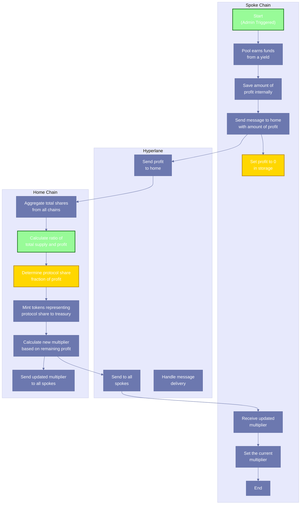
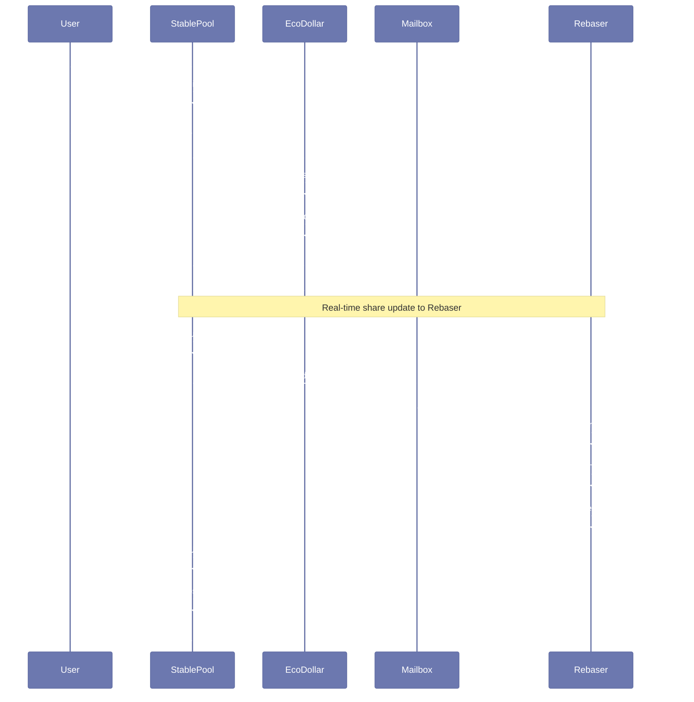
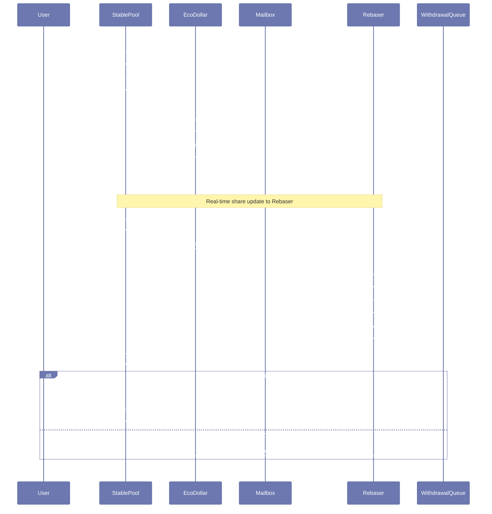
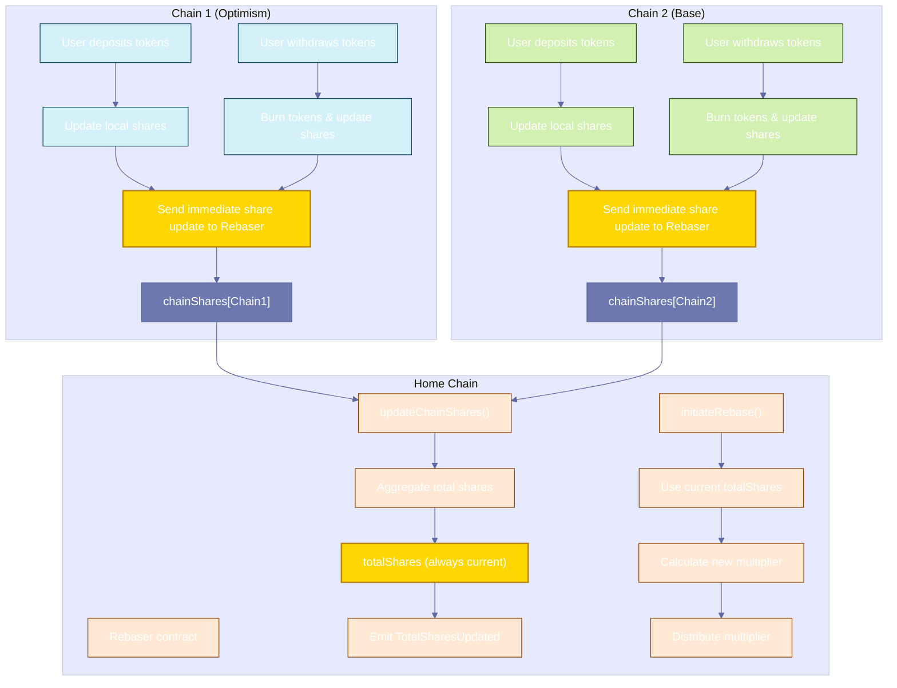

# Implementation Plan: Rebase Flow Implementation

> **FOLLOW [INSTRUCTIONS](../CLAUDE.md)!**
>
> ## Key Process References
>
> - **General Process**: Follow the [Task Execution Protocol](../CLAUDE.md#mandatory-execution-sequence)
> - **Decision Management**: Apply the [Decision Architecture](../CLAUDE.md#decision-architecture)
> - **Error Handling**: Use the [Problem Resolution System](../CLAUDE.md#problem-resolution-system)
> - **Scope Management**: Respect [Issue Classification System](../CLAUDE.md#issue-classification-system)
> - **Code Standards**: Implement [Solidity Implementation Requirements](../CLAUDE.md#solidity-implementation-requirements)
> - **Quality Assurance**: Follow [Development Discipline](../CLAUDE.md#development-discipline)
> - **Testing Commands**: Use [Solidity Development Imperatives](../CLAUDE.md#solidity-development-imperatives)
> - **Git Framework**: Adhere to [Git Execution Framework](../CLAUDE.md#git-execution-framework)

## Executive Summary

This implementation plan details the cross-chain Rebase Flow mechanism for the Eco Routes Protocol. The rebase flow ensures eUSD tokens maintain consistent value across all supported chains through a three-phase process: collection of local pool metrics, centralized calculation of the global multiplier, and distribution of updated rates to all participating chains. This implementation will fix critical bugs in the existing contracts, optimize cross-chain messaging, and provide robust error handling for all components.

## Implementation Information

- **Category**: Feature
- **Priority**: Critical
- **Estimated Time**: 10 hours
- **Affected Components**: StablePool, Rebaser, EcoDollar, Hyperlane integration
- **Parent Project Plan**: [Crowd Liquidity Project Plan](./crowd-liquidity-project-plan.md)
- **Related Implementation Plans**: None
- **Git Branch**: feat/rebase/rebase-flow-implementation

## Current Status and Technical Context

### System Architecture

The Rebase Flow operates across a multi-chain architecture with these core components:

1. **StablePool (per chain)**: Manages deposits/withdrawals and initiates rebase flow
2. **Rebaser (home chain only)**: Central coordinator for cross-chain rebase calculations
3. **EcoDollar (per chain)**: Rebasing token that uses share-based accounting
4. **Hyperlane Integration**: Cross-chain messaging protocol for communication

### Current Implementation Status

- **StablePool**: Basic rebase initiation exists but lacks proper state management
- **Rebaser**: Most calculation logic exists but needs error handling improvements
- **EcoDollar**: Share-based accounting implemented but rebase function needs validation
- **Critical Bug**: Double burn in StablePool withdraw function must be fixed
- **Missing Components**: Proper error handling, comprehensive testing, event emissions

## Goals and Scope

### Primary Goals

1. Implement complete cross-chain rebase flow matching the swimlane diagram
2. Fix critical issues in existing implementation (update reward multiplier, remove rebaseInProgress flag)
3. Ensure mathematically correct profit calculation and distribution
4. Implement secure protocol share allocation and treasury distribution
5. Build comprehensive test suite covering the entire rebase flow

### Out of Scope

1. Changes to the fundamental architecture of the system
2. Withdrawal queue processing (in a separate implementation plan)
3. Cross-chain message handling (will be handled by a service)
4. Testing integration with external messaging service
5. Changes to deployment strategy
6. UI integration or external system interactions

## Decision Points

### Decision 1: Rebase Trigger Mechanism

- [x] **Option A: Admin-triggered rebases**
  - **Pros**: Precise control over timing, gas optimization through batching, predictable operations
  - **Cons**: Requires active management, less autonomous than automated approaches
  - **Performance impact**: Less frequent rebases with potentially higher gas per operation
  - **Security implications**: Lower risk of timing manipulation, explicit authorization for each rebase
  
- [ ] **Option B: Automatic threshold-based rebases**
  - **Pros**: Fully autonomous operation, no manual intervention required
  - **Cons**: May trigger at suboptimal network times, harder to predict execution
  - **Performance impact**: More frequent rebases during volatile conditions
  - **Security implications**: Potential for gaming threshold triggers, complex validation needs

**Decision**: Option A selected (Admin-triggered rebases) based on user confirmation on 2025-03-26.

**Rationale**: Admin-triggered rebases provide precise operational control, align with the explicit "Start" action in the swimlane diagram, and enable gas optimization by scheduling rebases during low-congestion periods. This approach also reduces attack vectors by requiring explicit authorization.

### Decision 2: Protocol Fee Distribution

- [x] **Option A: Automatically mint protocol share to treasury**
  - **Pros**: Immediate fee capture, simpler execution flow, reduced gas costs
  - **Cons**: Less flexibility in fee allocation compared to delayed distribution
  - **Performance impact**: More gas-efficient due to single-step processing
  - **Security implications**: Cleaner security model with fewer entry points
  
- [ ] **Option B: Store protocol share for later distribution**
  - **Pros**: More flexible distribution strategies, adjustable allocation post-rebase
  - **Cons**: More complex state management, additional transactions needed
  - **Performance impact**: Less gas-efficient due to multi-step processing
  - **Security implications**: More attack vectors with additional entry points

**Decision**: Option A selected (Automatically mint protocol share to treasury) based on user confirmation on 2025-03-26.

**Rationale**: Direct minting to treasury provides a simpler implementation with fewer security considerations while reducing gas costs associated with fee management. This approach aligns with the current Rebaser contract design and provides predictable fee capture behavior.

## Technical Analysis

### Rebase Flow Process (from high-definition swimlane diagram)

The rebase flow follows this exact process as shown in the swimlane diagram:

#### 1. Spoke Chain (Collection Phase)
- Process starts with admin trigger ("Start" in diagram)
- Pool earns funds from a yield source
- Profit is tracked as a variable in the StablePool contract
- Total EcoDollar shares are tracked and updated on deposits/withdrawals
- Send a message to home chain with amount of profit and current total shares
- Set the profit to 0 in storage (critical for preventing double-counting)
- Later: Receive and set the current multiplier from home chain
- End rebase process

#### 2. Hyperlane (Messaging Layer)
- Send profit information to home chain
- Later: Send updated multiplier to all spoke chains
- Handle message delivery between chains

#### 3. Home Chain (Calculation Phase)
- Aggregate total shares reported from all chains
- Track total supply across the entire protocol
- Calculate ratio of total supply and profit that was received
- Determine protocol share (fraction of profit allocated to protocol)
- Mint tokens representing protocol share to the treasury
- Calculate new multiplier based on remaining profit and total shares
- Send the updated multiplier to all spoke chains


### Visual Implementation Flow



The diagram above illustrates the complete implementation flow with:
- **Green nodes**: Starting points in the process
- **Yellow nodes**: Critical operations that require special attention
- **Arrows**: Data flow between components

### Critical Issues Requiring Fixes

1. **No Validation Needed in EcoDollar.updateRewardMultiplier()**: Multiplier can be set to any value as determined by the rebase process.


## Implementation Details

### Files to Modify

- **contracts/StablePool.sol**
  - Add profit tracking variable to store accumulated profit
  - Update deposit and withdraw functions to track and report EcoDollar shares
  - Enhance rebase initiation with fixed authority check
  - Implement handle function for receiving rebase data
  - Add direct access to update EcoDollar's multiplier
  - Add event emissions for tracking share changes and rebase events

- **contracts/Rebaser.sol**
  - Implement tracking of total EcoDollar shares across all chains
  - Add share aggregation logic to handle function
  - Optimize protocol share calculation using protocolShareRate
  - Add owner-controlled function to update protocolShareRate
  - Add proper event emissions for share tracking and protocol share allocation
  - Combine chains and validChainIDs as a struct
  - Maintain proper protocol state for external message handling service

- **contracts/EcoDollar.sol**
  - Remove public rebase function entirely
  - Add privileged updateRewardMultiplier method accessible only to StablePool
  - Ensure share-to-token conversion remains accurate
  - Add event emissions for multiplier changes

- **contracts/interfaces/IEcoDollar.sol**
  - Add updateRewardMultiplier to interface for StablePool access

- **test/RebaseFlow.t.sol** (new file)
  - Implement comprehensive test suite for rebase flow

### Core Architecture Enhancements

#### 1. StablePool Share Tracking in Deposit/Withdraw

##### Deposit Flow with Rebaser Communication



##### Withdrawal Flow with Rebaser Communication



##### Implementation Details

```solidity
/**
 * @notice Deposit token and immediately update Rebaser with share delta
 * @param _token The token to deposit
 * @param _amount The amount to deposit
 */
function deposit(address _token, uint256 _amount) external {
    // Verify token is whitelisted
    if (tokenThresholds[_token] == 0) {
        revert InvalidToken(_token);
    }
    
    // Transfer token from user to pool
    IERC20(_token).safeTransferFrom(msg.sender, address(this), _amount);
    
    // Get shares before minting
    uint256 sharesBefore = IEcoDollar(REBASE_TOKEN).getTotalShares();
    
    // Mint eUSD tokens to the user
    IEcoDollar(REBASE_TOKEN).mint(msg.sender, _amount);
    
    // Get shares after minting to calculate delta
    uint256 sharesAfter = IEcoDollar(REBASE_TOKEN).getTotalShares();
    int256 shareDelta = int256(sharesAfter) - int256(sharesBefore);
    
    // Send immediate share delta to Rebaser (positive for deposit)
    _updateRebaserWithShareDelta(shareDelta);
    
    // Emit events for tracking
    emit Deposited(msg.sender, _token, _amount);
    emit SharesUpdated(sharesAfter, shareDelta);
}

/**
 * @notice Notify Rebaser of share delta (positive for increase, negative for decrease)
 * @param _shareDelta The change in shares (can be positive or negative)
 */
function _updateRebaserWithShareDelta(int256 _shareDelta) internal {
    // Skip update if no change (though this should never happen)
    if (_shareDelta == 0) return;
    
    // Encode message with share delta
    bytes memory message = abi.encode(_shareDelta);
    
    // Quote fee for cross-chain message
    uint256 fee = IMailbox(MAILBOX).quoteDispatch(
        HOME_CHAIN,
        REBASER,
        message,
        "", // Empty metadata for relayer
        IPostDispatchHook(RELAYER)
    );
    
    // Send share delta to Rebaser
    IMailbox(MAILBOX).dispatch{value: fee}(
        HOME_CHAIN,
        REBASER,
        message,
        "", // Empty metadata for relayer
        IPostDispatchHook(RELAYER)
    );
}

/**
 * @notice Withdraw tokens and immediately update Rebaser with share delta
 * @param _preferredToken The token to withdraw
 * @param _amount The amount to withdraw
 */
function withdraw(address _preferredToken, uint80 _amount) external {
    // Verify token is whitelisted
    if (tokenThresholds[_preferredToken] == 0) {
        revert InvalidToken(_preferredToken);
    }
    
    // Check user's balance
    uint256 tokenBalance = IERC20(REBASE_TOKEN).balanceOf(msg.sender);
    if (tokenBalance < _amount) {
        revert InsufficientTokenBalance(
            _preferredToken,
            tokenBalance,
            _amount
        );
    }
    
    // Get shares before burning
    uint256 sharesBefore = IEcoDollar(REBASE_TOKEN).getTotalShares();
    
    // Burn eUSD tokens
    IEcoDollar(REBASE_TOKEN).burn(msg.sender, _amount);
    
    // Get shares after burning to calculate delta
    uint256 sharesAfter = IEcoDollar(REBASE_TOKEN).getTotalShares();
    int256 shareDelta = int256(sharesAfter) - int256(sharesBefore);
    // shareDelta will be negative for withdrawals
    
    // Send immediate share delta to Rebaser
    _updateRebaserWithShareDelta(shareDelta);
    
    // Track locally and emit event
    emit SharesUpdated(sharesAfter, shareDelta);
    
    // Process withdrawal
    if (IERC20(_preferredToken).balanceOf(address(this)) > tokenThresholds[_preferredToken] + _amount) {
        // Sufficient liquidity, process withdrawal immediately
        IERC20(_preferredToken).safeTransfer(msg.sender, _amount);
        emit Withdrawn(msg.sender, _preferredToken, _amount);
    } else {
        // Insufficient liquidity, add to withdrawal queue
        _addToWithdrawalQueue(_preferredToken, msg.sender, _amount);
    }
}
```

#### 2. Rebaser Total Shares Tracking

##### Real-time Share Tracking System



##### Implementation Details

```solidity
/**
 * @dev Processes and aggregates shares from all chains
 * @param _origin The chain ID that reported shares
 * @param _shares The number of shares reported from that chain
 */
/**
 * @notice Handle share delta updates from StablePool contracts
 * @param _origin The chain ID from which the message was sent
 * @param _sender The address that sent the message (32-byte form)
 * @param _message The encoded payload containing share delta
 */
function handleShareDelta(
    uint32 _origin,
    bytes32 _sender,
    bytes calldata _message
) external payable {
    // Security validations
    if (msg.sender != MAILBOX) {
        revert UnauthorizedMailbox(msg.sender, MAILBOX);
    }
    
    if (_sender != POOL) {
        revert UnauthorizedSender(_sender, POOL);
    }
    
    if (!validChainIDs[_origin]) {
        revert InvalidOriginChain(_origin);
    }
    
    // Decode message payload - single value containing share delta (can be positive or negative)
    int256 shareDelta = abi.decode(_message, (int256));
    
    // Update chain shares using delta - ordering doesn't matter with deltas
    _updateChainSharesDelta(_origin, shareDelta);
}

/**
 * @notice Update shares for a specific chain using delta and recalculate global total
 * @param _origin The chain ID that reported share change
 * @param _shareDelta The change in shares (positive for increase, negative for decrease)
 */
function _updateChainSharesDelta(uint32 _origin, int256 _shareDelta) private {
    // Skip processing if delta is zero
    if (_shareDelta == 0) return;
    
    // Apply delta to current chain shares - handle both positive and negative
    if (_shareDelta > 0) {
        // Safe addition - increase in shares
        chainShares[_origin] += uint256(_shareDelta);
    } else {
        // Safe subtraction - decrease in shares
        uint256 absDelta = uint256(-_shareDelta);
        
        // Prevent underflow
        if (absDelta > chainShares[_origin]) {
            // This should never happen but handle it safely
            chainShares[_origin] = 0;
        } else {
            chainShares[_origin] -= absDelta;
        }
    }
    
    // Recalculate total shares across all chains
    uint256 totalSharesAcrossChains = 0;
    for (uint256 i = 0; i < chains.length; i++) {
        totalSharesAcrossChains += chainShares[chains[i]];
    }
    
    // Update total shares state
    totalShares = totalSharesAcrossChains;
    
    // Emit event for tracking
    emit TotalSharesUpdated(totalShares, _origin, _shareDelta);
}
```

#### 3. IEcoDollar Interface Update

```solidity
interface IEcoDollar {
    // Existing methods...
    
    /**
     * @notice Update the reward multiplier - privileged method accessible only to StablePool
     * @param _newMultiplier The new reward multiplier value
     */
    function updateRewardMultiplier(uint256 _newMultiplier) external;
    
    /**
     * @notice Get the current reward multiplier
     * @return The current reward multiplier value
     */
    function rewardMultiplier() external view returns (uint256);
    
    // Other methods...
}
```

#### 2. StablePool Rebase Initiation

```solidity
/**
 * @notice Broadcasts yield information to the home chain for rebase calculations
 * @param _tokens The current list of token addresses to include in calculation
 * @dev Only callable by owner, initiates the cross-chain rebase process
 * @dev Follows the exact steps in the swimlane diagram:
 *      1. Start (admin triggered)
 *      2. Pool earns funds from yield
 *      3. Save amount of profit
 *      4. Send message to home
 *      5. Set profit to 0 in storage
 */
function initiateRebase(
    address[] calldata _tokens
) external checkTokenList(_tokens) {
    // Only allowed to be called by a fixed address with authority to trigger rebases
    if (msg.sender != REBASE_AUTHORITY) {
        revert UnauthorizedRebaseInitiator(msg.sender, REBASE_AUTHORITY);
    }
    // Note: We allow concurrent rebases since they don't conflict
    // Each rebase resets profit to zero, and new rebases simply add new profit
    
    // Calculate local token balances (earned from yield)
    uint256 length = _tokens.length;
    uint256 localTokens = 0;
    
    for (uint256 i = 0; i < length; ++i) {
        // Safe to use unchecked for gas optimization as token balances are limited
        unchecked {
            localTokens += IERC20(_tokens[i]).balanceOf(address(this));
        }
    }
    
    // Get total shares from EcoDollar
    uint256 localShares = IEcoDollar(REBASE_TOKEN).getTotalShares();
    
    // Get current accumulated profit value (tracked as a variable in StablePool)
    uint256 profit = accumulatedProfit;
    
    // Encode message with local metrics including profit
    // Use consistent encoding format for external service integration
    bytes memory message = abi.encode(
        localTokens,  // Total tokens across all supported assets
        localShares,  // Total shares from EcoDollar
        profit        // Accumulated profit since last rebase
    );
    
    // This message will be processed by the external cross-chain messaging service
    // The exact integration mechanism will be implemented by the service
    // For testing purposes, we use Hyperlane's mailbox interface
    
    // Quote fee for cross-chain message
    uint256 fee = IMailbox(MAILBOX).quoteDispatch(
        HOME_CHAIN,
        REBASER,
        message,
        "", // Empty metadata for relayer
        IPostDispatchHook(RELAYER)
    );
    
    // Dispatch message to home chain
    uint256 messageId = IMailbox(MAILBOX).dispatch{value: fee}(
        HOME_CHAIN,
        REBASER,
        message,
        "", // Empty metadata for relayer
        IPostDispatchHook(RELAYER)
    );
    
    // Critical: Set profit to 0 in storage to prevent double-counting
    accumulatedProfit = 0;
    
    // Emit event for tracking
    emit RebaseInitiated(localTokens, localShares, profit, HOME_CHAIN, messageId);
}
```

#### 2. Rebaser Constructor and protocolShareRate Management

```solidity
/**
 * @notice Initialize the Rebaser contract with required parameters
 * @param _mailbox Address of the Hyperlane mailbox
 * @param _chainIds Array of valid chain IDs
 * @param _treasury Address of the treasury to receive protocol share
 * @param _initialProtocolShareRate Initial rate for protocol share allocation (in BASE units)
 */
constructor(
    address _mailbox,
    uint32[] memory _chainIds,
    address _treasury,
    uint256 _initialProtocolShareRate
) Ownable(msg.sender) {
    MAILBOX = _mailbox;
    TREASURY_ADDRESS = _treasury;
    
    // Set initial protocol share rate (in BASE units, e.g., 0.2 * 1e18 for 20%)
    protocolShareRate = _initialProtocolShareRate;
    
    // Initialize chain management
    for (uint256 i = 0; i < _chainIds.length; i++) {
        chains.push(_chainIds[i]);
        validChainIDs[_chainIds[i]] = true;
    }
    
    emit ProtocolShareRateSet(_initialProtocolShareRate);
}

/**
 * @notice Update the protocol share rate
 * @param _newRate New protocol share rate (in BASE units)
 * @dev Only callable by contract owner
 */
function setProtocolShareRate(uint256 _newRate) external onlyOwner {
    require(_newRate <= BASE, "Rate cannot exceed 100%");
    uint256 oldRate = protocolShareRate;
    protocolShareRate = _newRate;
    emit ProtocolShareRateSet(_newRate);
}

#### 3. Rebaser Message Handling

/**
 * @dev Hyperlane message handler for processing rebase data from spoke chains
 * @param _origin The chain ID from which the message was sent
 * @param _sender The address that sent the message (32-byte form)
 * @param _message The encoded payload containing shares, balances and profit
 * @dev Follows the exact steps in the swimlane diagram:
 *      1. Calculate ratio of total supply and profit received
 *      2. Determine protocol share (fraction of profit allocated to protocol)
 *      3. Mint tokens representing protocol share to treasury
 *      4. Calculate new multiplier based on remaining profit
 *      5. Send updated multiplier to all spokes
 */
function handle(
    uint32 _origin,
    bytes32 _sender,
    bytes calldata _message
) external payable override {
    // Security validations
    if (msg.sender != MAILBOX) {
        revert UnauthorizedMailbox(msg.sender, MAILBOX);
    }
    
    if (_sender != POOL) {
        revert UnauthorizedSender(_sender, POOL);
    }
    
    if (!validChainIDs[_origin]) {
        revert InvalidOriginChain(_origin);
    }
    
    // Decode message payload using the same encoding format as StablePool
    (uint256 balances, uint256 shares, uint256 profit) = abi.decode(
        _message,
        (uint256, uint256, uint256)
    );
    
    // Update chain data counters
    chainReports[_origin] = true;
    currentChainCount++;
    
    // Track shares for this specific chain and update total
    trackChainShares(_origin, shares);
    
    // Also update local variables for calculation
    sharesTotal = totalShares; // Use the global totalShares updated by trackChainShares
    balancesTotal += balances;
    profitTotal += profit;
    
    // Emit data receipt event
    emit ReceivedRebaseInformation(_origin, balances, shares, profit);
    
    // If all chains have reported, calculate and propagate rebase
    if (currentChainCount == chains.length) {
        // STEP 1: Calculate ratio of total supply and profit that was got
        // This calculates the net new balances (effectively the profit)
        uint256 netNewBalances = profitTotal;
        
        // Handle zero profit scenario
        if (netNewBalances <= 0) {
            _resetRebaseState();
            return;
        }
        
        // STEP 2: Increment global reward rate
        // Calculate new multiplier based on total balances and shares
        uint256 newMultiplier = ((balancesTotal) * BASE) / sharesTotal;
        
        // STEP 2: Determine protocol share (fraction of profit allocated to protocol)
        // protocolShareRate is set during construction and can be updated by the contract owner
        uint256 protocolShareAmount = (netNewBalances * protocolShareRate) / BASE;
        
        // STEP 3: Mint tokens representing protocol share to treasury
        if (protocolShareAmount > 0) {
            // TOKEN refers to local EcoDollar contract on home chain
            // TREASURY_ADDRESS is a predefined constant address for the treasury
            IEcoDollar(TOKEN).mint(TREASURY_ADDRESS, protocolShareAmount);
        }
        
        // STEP 4: Calculate new multiplier based on remaining profit
        newMultiplier = ((balancesTotal - protocolShareAmount) * BASE) / sharesTotal;
        
        // Update current multiplier
        currentMultiplier = newMultiplier;
        
        // Emit calculation event
        emit CalculatedRebase(
            balancesTotal,
            sharesTotal,
            netNewBalances,
            protocolShareAmount,
            newMultiplier
        );
        
        // STEP 4: Send to all spokes
        // Propagate rebase to all chains
        for (uint256 i = 0; i < chains.length; i++) {
            uint32 chain = chains[i];
            _propagateRebase(chain, newMultiplier);
        }
        
        // Reset state for next rebase cycle
        _resetRebaseState();
    }
}


/**
 * @dev Internal function to reset rebase state
 */
function _resetRebaseState() private {
    // Reset chain counters
    currentChainCount = 0;
    sharesTotal = 0;
    balancesTotal = 0;
    
    // Reset chain reports
    for (uint256 i = 0; i < chains.length; i++) {
        chainReports[chains[i]] = false;
    }
}

/**
 * @dev Internal function to propagate rebase to a specific chain
 * @param _chain The destination chain ID
 * @param _multiplier The new reward multiplier
 */
function _propagateRebase(
    uint32 _chain,
    uint256 _multiplier
) private {
    propagateRebase(_chain, _multiplier);
}

/**
 * @notice Propagates rebase data to a specified chain
 * @param _chain The destination chain ID
 * @param _multiplier The new reward multiplier
 */
function propagateRebase(
    uint32 _chain,
    uint256 _multiplier
) private {
    // Encode message with rebase data - consistent format for external service
    // Simple single value encoding for the new multiplier value
    bytes memory message = abi.encode(_multiplier);
    
    // This message will be processed by the external cross-chain messaging service
    // The exact integration mechanism will be implemented by the service
    // For testing purposes, we use Hyperlane's mailbox interface
    
    // Quote fee for cross-chain message
    uint256 fee = IMailbox(MAILBOX).quoteDispatch(
        _chain,
        POOL,
        message,
        "", // Empty metadata for relayer
        IPostDispatchHook(RELAYER)
    );
    
    // Dispatch message to destination chain
    uint256 messageId = IMailbox(MAILBOX).dispatch{value: fee}(
        _chain,
        POOL,
        message,
        "", // Empty metadata for relayer
        IPostDispatchHook(RELAYER)
    );
    
    // Log message ID for reference
}
```

#### 3. Direct Reward Multiplier Updates

The EcoDollar contract will no longer have a separate rebase method. Instead, the StablePool contract will directly update the reward multiplier during the handle method when receiving the hyperlane message from the home chain.

#### 4. StablePool Rebase Finalization

```solidity
/**
 * @notice Handles incoming rebase message from home chain
 * @param _origin The origin chain ID
 * @param _sender The sender address in 32-byte form
 * @param _message The message payload
 * @dev Follows the exact steps in the swimlane diagram:
 *      1. Receive the message from the home chain
 *      2. Sets the current multiplier
 *      3. End
 */
function handle(
    uint32 _origin,
    bytes32 _sender,
    bytes calldata _message
) external payable override {
    // Security validations
    if (msg.sender != MAILBOX) {
        revert UnauthorizedMailbox(msg.sender, MAILBOX);
    }
    
    if (_sender != REBASER) {
        revert UnauthorizedSender(_sender, REBASER);
    }
    
    if (_origin != HOME_CHAIN) {
        revert InvalidOriginChain(_origin, HOME_CHAIN);
    }
    
    // Decode message payload using the same format as Rebaser's propagateRebase
    uint256 newMultiplier = abi.decode(
        _message,
        (uint256)
    );
    
    // STEP 1: Receive the message from home chain
    // This is handled by the Hyperlane protocol
    
    // STEP 2: Directly update the reward multiplier in EcoDollar
    // We'll directly access EcoDollar's state instead of using a separate rebase method
    uint256 oldMultiplier = IEcoDollar(REBASE_TOKEN).rewardMultiplier();
    
    // Direct access to update the multiplier through a privileged method in StablePool
    // that has access to update EcoDollar state
    _updateEcoDollarMultiplier(newMultiplier);
    
    // No need to reset rebase state as concurrent rebases are allowed
    
    // Emit rebase completion event
    emit RebaseFinalized(oldMultiplier, newMultiplier);
    
    // STEP 3: End process
    // No further action required, process is complete
}

/**
 * @dev Updates the reward multiplier in the EcoDollar contract
 * @param _newMultiplier The new multiplier value to set
 */
function _updateEcoDollarMultiplier(uint256 _newMultiplier) internal {
    // This function assumes StablePool has the authority to directly update
    // EcoDollar's reward multiplier through a privileged interface
    uint256 oldMultiplier = IEcoDollar(REBASE_TOKEN).rewardMultiplier();
    IEcoDollar(REBASE_TOKEN).updateRewardMultiplier(_newMultiplier);
    
    // Emit event with old and new values
    emit EcoDollarMultiplierUpdated(oldMultiplier, _newMultiplier);
}

```

#### 5. Fix Double Burn Issue in StablePool.withdraw

```solidity
/**
 * @notice Withdraw `_amount` of `_preferredToken` from the pool
 * @param _preferredToken The token to withdraw
 * @param _amount The amount to withdraw
 * @dev If pool balance is below threshold, user is added to the withdrawal queue
 */
function withdraw(address _preferredToken, uint80 _amount) external {
    // Verify token is whitelisted
    if (tokenThresholds[_preferredToken] == 0) {
        revert InvalidToken(_preferredToken);
    }
    
    // Check user's balance
    uint256 tokenBalance = IERC20(REBASE_TOKEN).balanceOf(msg.sender);
    if (tokenBalance < _amount) {
        revert InsufficientTokenBalance(
            _preferredToken,
            tokenBalance,
            _amount
        );
    }
    
    // Burn eUSD tokens - THIS OCCURS ONLY ONCE TO FIX DOUBLE BURN BUG
    IEcoDollar(REBASE_TOKEN).burn(msg.sender, _amount);
    
    // Check if withdrawal can be processed immediately
    uint256 poolTokenBalance = IERC20(_preferredToken).balanceOf(address(this));
    if (poolTokenBalance > tokenThresholds[_preferredToken] + _amount) {
        // Sufficient liquidity, process withdrawal immediately
        IERC20(_preferredToken).safeTransfer(msg.sender, _amount);
        emit Withdrawn(msg.sender, _preferredToken, _amount);
    } else {
        // Insufficient liquidity, add to withdrawal queue
        _addToWithdrawalQueue(_preferredToken, msg.sender, _amount);
    }
}
```

### Custom Error and Event Definitions

```solidity
// StablePool errors
error UnauthorizedMailbox(address actual, address expected);
error UnauthorizedSender(bytes32 actual, bytes32 expected);
error InvalidOriginChain(uint32 actual, uint32 expected);
error UnauthorizedRebaseInitiator(address actual, address expected);

// Rebaser errors
error InvalidOriginChain(uint32 chain);

// StablePool events
event RebaseInitiated(uint256 balances, uint256 shares, uint256 profit, uint32 homeChain, uint256 messageId);
event RebaseFinalized(uint256 oldMultiplier, uint256 newMultiplier);
event EcoDollarMultiplierUpdated(uint256 oldMultiplier, uint256 newMultiplier);
event SharesUpdated(uint256 newTotalShares, int256 shareDelta);
event Deposited(address indexed user, address indexed token, uint256 amount);
event Withdrawn(address indexed user, address indexed token, uint256 amount);

// Rebaser events
event ReceivedRebaseInformation(uint32 origin, uint256 balances, uint256 shares, uint256 profit);
event CalculatedRebase(uint256 balancesTotal, uint256 sharesTotal, uint256 profitTotal, uint256 protocolShareAmount, uint256 newMultiplier);
event ProtocolShareMinted(uint256 protocolShareAmount, address treasury);
event ProtocolShareRateSet(uint256 newRate);
event TotalSharesUpdated(uint256 totalShares, uint32 originChain, int256 shareDelta);
```


### Message Encoding Standards

The following encoding formats are used consistently throughout the system for future service integration:

1. **StablePool to Rebaser** (share delta message):
   ```solidity
   abi.encode(shareDelta)
   ```
   Where:
   - `shareDelta`: Change in shares (int256, positive for deposits, negative for withdrawals)
   
2. **StablePool to Rebaser** (rebase initiation):
   ```solidity
   abi.encode(localTokens, localShares, profit)
   ```
   Where:
   - `localTokens`: Total value of tokens held by the pool
   - `localShares`: Total EcoDollar shares
   - `profit`: Accumulated profit since last rebase

3. **Rebaser to StablePool** (multiplier update):
   ```solidity
   abi.encode(newMultiplier)
   ```
   Where:
   - `newMultiplier`: New reward multiplier value to be applied

Note: External cross-chain message handling and service integration testing are out of scope for this implementation.

### Gas Optimization Techniques

1. **Message Encoding Optimization**: Minimize cross-chain message size by including only essential data

2. **Unchecked Math Operations**: Use unchecked blocks for arithmetic that cannot overflow

3. **Struct Packing**: Combine chains and validChainIDs as a struct with field packing

4. **Memory vs. Storage**: Optimize storage reads/writes by using memory variables

5. **Loop Optimization**: Optimize loops in token balance calculation

6. **Validation Ordering**: Order validations to fail fast and avoid unnecessary computation

## Testing Strategy

### Unit Testing Suite

1. **StablePool Tests**:
   - `testInitiateRebaseValidParams`: Verify function works with valid parameters
   - `testInitiateRebaseInvalidParams`: Verify function rejects invalid parameters
   - `testRebaseStateManagement`: Verify rebaseInProgress flag is properly managed
   - `testHandleValidMessage`: Verify handle function processes valid messages
   - `testHandleInvalidMessage`: Verify handle function rejects invalid messages
   - `testProtocolFeeCollection`: Verify fees are correctly collected
   - `testFixDoubleWithdrawBug`: Verify withdrawal only burns tokens once

2. **Rebaser Tests**:
   - `testHandleFunction`: Verify proper handling of incoming messages
   - `testPartialReports`: Test behavior when only some chains report
   - `testCalculationLogic`: Verify correct calculation of multipliers
   - `testPropagateRebase`: Verify rebase propagation
   - `testErrorHandling`: Verify proper handling of error conditions
   - `testProtocolFeeCalculation`: Verify protocol fee is calculated correctly

3. **EcoDollar Tests**:
   - `testDirectMultiplierUpdate`: Verify only StablePool can update the multiplier
   - `testShareToTokenConversion`: Verify correct conversion before and after multiplier changes
   - `testEventEmissions`: Verify proper events are emitted upon multiplier changes

### Unit Tests

1. **StablePool Profit Tracking**:
   ```typescript
   it("should track and reset profit correctly", async function() {
     // Deploy StablePool contract
     const stablePool = await deployStablePool();
     
     // Update accumulated profit (simulating yield generation)
     await updateAccumulatedProfit(stablePool, 1000);
     
     // Verify profit is tracked
     const profit = await stablePool.accumulatedProfit();
     expect(profit).to.equal(1000);
     
     // Trigger rebase
     await stablePool.initiateRebase(tokenList);
     
     // Verify profit is reset
     const newProfit = await stablePool.accumulatedProfit();
     expect(newProfit).to.equal(0);
   });
   ```

2. **Protocol Share Calculation**:
   ```typescript
   it("should calculate protocol share correctly", async function() {
     // Deploy Rebaser with initial protocol share rate
     const initialRate = ethers.utils.parseEther("0.2"); // 20%
     const rebaser = await deployRebaser(initialRate);
     
     // Set up test parameters
     const netNewBalances = 1000;
     const sharesTotal = 500;
     
     // Calculate expected protocol share
     const expectedShare = (netNewBalances * initialRate) / BASE;
     
     // Call calculateProtocolShare (test helper function)
     const protocolShare = await rebaser.calculateProtocolShare(netNewBalances);
     
     // Verify calculation
     expect(protocolShare).to.equal(expectedShare);
   });
   ```

3. **Message Format Consistency**:
   ```typescript
   it("should use consistent message formats", async function() {
     // Test encoding/decoding on StablePool side
     const encoded = await testEncodeProfitMessage(100, 200, 300);
     const decoded = await testDecodeProfitMessage(encoded);
     
     // Verify decoded values match original inputs
     expect(decoded.localTokens).to.equal(100);
     expect(decoded.localShares).to.equal(200);
     expect(decoded.profit).to.equal(300);
     
     // Test encoding/decoding on Rebaser side
     const multiplier = ethers.utils.parseEther("1.1");
     const encodedMultiplier = await testEncodeMultiplierMessage(multiplier);
     const decodedMultiplier = await testDecodeMultiplierMessage(encodedMultiplier);
     
     // Verify decoded multiplier matches original
     expect(decodedMultiplier).to.equal(multiplier);
   });
   ```

### Validation Commands

```bash
# Run specific rebase tests
forge test --match-contract RebaseFlow -vv

# Test specifically for double burn fix
forge test --match-test testFixDoubleWithdrawBug -vv

# Run all tests
forge test

# Check gas usage
forge snapshot

# Run security analysis
slither contracts/Rebaser.sol --detect reentrancy-eth,reentrancy-no-eth
slither contracts/StablePool.sol --detect divide-before-multiply,incorrect-equality
slither contracts/EcoDollar.sol --detect unchecked-lowlevel
```

## Implementation Steps

- [ ] Step 1: Set up advanced testing infrastructure [Priority: High] [Est: 1.5h]
  - [ ] Sub-task 1.1: Create mock contracts with comprehensive functionality (mock Hyperlane mailbox, mock ERC20s)
  - [ ] Sub-task 1.2: Set up multi-chain testing framework using parallel anvil instances
  - [ ] Sub-task 1.3: Create helper functions for cross-chain test scenarios

- [ ] Step 2: Fix critical issues [Priority: Critical] [Est: 0.5h]
  - [ ] Sub-task 2.1: Update EcoDollar with updateRewardMultiplier method
  - [ ] Sub-task 2.2: Write tests verifying fixes
  - [ ] Sub-task 2.3: Run security analysis on fixed code

- [ ] Step 3: Implement share delta reporting from StablePool [Priority: High] [Est: 2.5h]
  - [ ] Sub-task 3.1: Add accumulatedProfit variable to StablePool contract
  - [ ] Sub-task 3.2: Add _updateRebaserWithShareDelta helper function for cross-chain messaging
  - [ ] Sub-task 3.3: Update deposit function to calculate and send share deltas to Rebaser
  - [ ] Sub-task 3.4: Update withdraw function to calculate and send share deltas to Rebaser
  - [ ] Sub-task 3.5: Update SharesUpdated event to include share delta
  - [ ] Sub-task 3.6: Write tests for share delta tracking
  - [ ] Sub-task 3.7: Implement initiateRebase with fixed authority check
  - [ ] Sub-task 3.8: Ensure proper profit reset in storage (accumulatedProfit = 0)

- [ ] Step 4: Implement Rebaser share delta tracking [Priority: High] [Est: 2.5h]
  - [ ] Sub-task 4.1: Add chainShares mapping to track shares by chain ID
  - [ ] Sub-task 4.2: Implement totalShares state variable for cross-chain aggregation
  - [ ] Sub-task 4.3: Add handleShareDelta function to process delta-based updates
  - [ ] Sub-task 4.4: Implement _updateChainSharesDelta helper with safe math
  - [ ] Sub-task 4.5: Update TotalSharesUpdated event to include origin chain and delta
  - [ ] Sub-task 4.6: Update rebase calculation function to use current totalShares value
  - [ ] Sub-task 4.7: Write tests for share delta tracking functionality
  - [ ] Sub-task 4.8: Add constructor parameter for initialProtocolShareRate
  - [ ] Sub-task 4.9: Implement owner-controlled setProtocolShareRate function
  - [ ] Sub-task 4.10: Implement protocol share allocation and minting to treasury

- [ ] Step 5: Refine EcoDollar's multiplier update mechanism [Priority: High] [Est: 1h]
  - [ ] Sub-task 5.1: Enhance updateRewardMultiplier method security
  - [ ] Sub-task 5.2: Improve event emissions for multiplier changes
  - [ ] Sub-task 5.3: Verify share-to-token conversion accuracy across multiplier changes

- [ ] Step 6: Complete StablePool rebase finalization [Priority: High] [Est: 1.5h]
  - [ ] Sub-task 6.1: Write tests for StablePool's handle function with various scenarios
  - [ ] Sub-task 6.2: Implement handle function exactly as shown in swimlane diagram
  - [ ] Sub-task 6.3: Implement direct EcoDollar multiplier update from StablePool
  - [ ] Sub-task 6.4: Ensure proper end-of-process handling


- [ ] Step 8: Build integration test suite [Priority: Critical] [Est: 1.5h]
  - [ ] Sub-task 8.1: Create unit tests for StablePool and Rebaser components
  - [ ] Sub-task 8.2: Test message format consistency across components
  - [ ] Sub-task 8.3: Verify correct profit tracking and reset
  - [ ] Sub-task 8.4: Verify protocol share minting on home chain only

- [ ] Step 9: Security and optimization [Priority: Critical] [Est: 1.5h]
  - [ ] Sub-task 9.1: Run comprehensive security analysis with Slither
  - [ ] Sub-task 9.2: Measure and optimize gas usage for cross-chain operations
  - [ ] Sub-task 9.3: Verify access control across all components
  - [ ] Sub-task 9.4: Complete NatSpec documentation for all functions
  - [ ] Sub-task 9.5: Generate gas report and security analysis documentation

## Validation Checkpoints

### Implementation Validation Matrix

| Subtask | Compilation | Test Coverage | Security Checks | Gas Analysis | Documentation |
|---------|-------------|---------------|-----------------|--------------|---------------|
| 1.1-1.3 Test infrastructure | Must compile | Framework tested | N/A | N/A | Test strategy documented |
| 2.1-2.4 Fix critical bugs | Must compile | 100% coverage | Slither validation | Before/after comparison | Bug fix documented |
| 3.1-3.4 StablePool rebase | Must compile | 100% coverage | Access control verified | Gas snapshot | NatSpec complete |
| 4.1-4.5 Rebaser calculation | Must compile | 100% coverage | Math safety verified | Gas optimization | NatSpec complete |
| 5.1-5.5 EcoDollar updates | Must compile | 100% coverage | Privilege checks verified | Gas analysis | NatSpec complete |
| 6.1-6.4 Rebase finalization | Must compile | 100% coverage | No protocol fee minting verified | Gas snapshot | NatSpec complete |
| 7.1-7.5 Integration testing | Must compile | E2E flow covered | Attack vectors tested | N/A | Test cases documented |
| 8.1-8.5 Security & optimization | Must compile | All tests pass | No critical findings | 10%+ gas reduction | Complete report |

### Quality Requirements

- **Code must follow all [Solidity Implementation Requirements](../CLAUDE.md#solidity-implementation-requirements)**
- **100% test coverage for all modified functions**
- **All functions must have comprehensive NatSpec documentation**
- **All public/external functions must use custom errors instead of require strings**
- **All state changes must emit appropriate events**
- **All code must follow the checks-effects-interactions pattern**
- **All functions must implement proper access control**

## Risk Assessment

### High-Risk Areas

1. **Protocol Share Calculation**
   - **Risk**: Incorrect calculation could lead to over/under-minting of protocol share tokens
   - **Mitigation**: Comprehensive testing with diverse scenarios, mathematical verification

2. **Rebase State Management**
   - **Risk**: Improper state management could block future rebases
   - **Mitigation**: Ensure state is reset properly even on errors, add admin recovery function

Note: Cross-chain message handling will be handled by a separate service, so associated risks and service integration testing are out of scope for this implementation.

### Medium-Risk Areas

1. **Gas Optimization**
   - **Risk**: Inefficient code could make operations too expensive
   - **Mitigation**: Gas benchmarking, optimization of hot paths, minimize storage operations


2. **Chain Addition/Removal**
   - **Risk**: Adding/removing chains could disrupt rebase flow
   - **Mitigation**: Ensure proper chain validation in contract code

## Rollback and Recovery Plan

If implementation fails or critical issues are discovered:

1. **For Critical Bugs**:
   - Immediately implement focused fix for specific issue
   - Run comprehensive tests to verify fix works
   - Deploy emergency update if already in production

2. **For Complex Implementation Issues**:
   ```bash
   # Create debug branch for analysis
   git checkout -b debug/rebase-flow-issue-<issue-id>
   
   # Isolate issue
   git bisect start
   git bisect bad HEAD
   git bisect good <known-good-commit>
   
   # Once issue is found, fix on main branch
   git checkout feat/rebase/rebase-flow-implementation
   
   # Apply targeted fix
   git cherry-pick -x <fix-commit>
   ```

3. **For Cross-Chain Coordination Issues**:
   - Implement circuit breaker in home chain Rebaser
   - Add admin recovery function to reset stuck rebase state
   - Create diagnostic function to verify system consistency

## Progress Tracking

- [x] Plan created
- [x] Plan approved by user
- [x] Decisions confirmed (all Decision Points have exactly ONE selected option)
- [ ] Implementation complete
- [ ] Testing complete
- [ ] Final review complete

## Commit Message Template

```
<type>(<scope>): <concise description>

- Completed subtask X.Y: <subtask name>
- Test coverage: 100% (functions: X/X, lines: X/X, branches: X/X)
- Security: <key security checks performed>
- Gas optimization: <gas savings achieved>

🤖 Generated with [Claude Code](https://claude.ai/code)
```

---

> **IMPORTANT: Before moving to implementation:**
>
> 1. Confirm user approval for the plan
> 2. Ensure all Decision Points have exactly ONE selected option
> 3. Verify pre-execution checklist is complete
>
> **Key Commands to Run:**
>
> - After ANY code changes: `forge fmt`
> - After ANY contract modifications: `forge test`
> - For gas optimization verification: `forge snapshot`
> - For security analysis: `slither .`